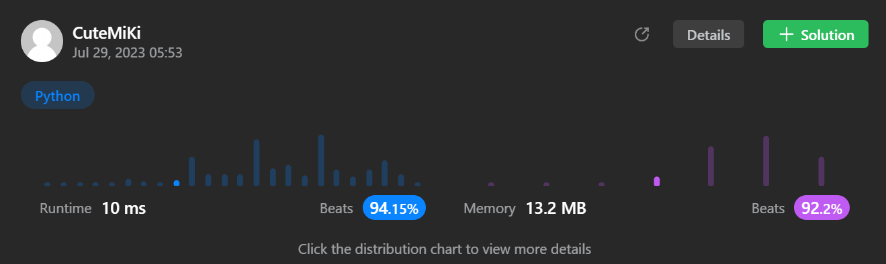

# 100. Same Tree
### Tag: [Easy](https://github.com/TheOnlyMiki/LeetCode-For-Fun/tree/main#easy-level), [Depth-First Search](https://github.com/TheOnlyMiki/LeetCode-For-Fun/tree/main#depth-first-search), [Breadth-First Search](https://github.com/TheOnlyMiki/LeetCode-For-Fun/tree/main#breadth-first-search), [Binary Tree](https://github.com/TheOnlyMiki/LeetCode-For-Fun/tree/main#binary-tree)
---
<div class="px-5 pt-4"><div class="flex"></div><div class="_1l1MA" data-track-load="description_content"><p>Given the roots of two binary trees <code>p</code> and <code>q</code>, write a function to check if they are the same or not.</p>

<p>Two binary trees are considered the same if they are structurally identical, and the nodes have the same value.</p>

<p>&nbsp;</p>
<p><strong class="example">Example 1:</strong></p>

<pre><strong>Input:</strong> p = [1,2,3], q = [1,2,3]
<strong>Output:</strong> true
</pre>

<p><strong class="example">Example 2:</strong></p>

<pre><strong>Input:</strong> p = [1,2], q = [1,null,2]
<strong>Output:</strong> false
</pre>

<p><strong class="example">Example 3:</strong></p>

<pre><strong>Input:</strong> p = [1,2,1], q = [1,1,2]
<strong>Output:</strong> false
</pre>

<p>&nbsp;</p>
<p><strong>Constraints:</strong></p>

<ul>
	<li>The number of nodes in both trees is in the range <code>[0, 100]</code>.</li>
	<li><code>-10<sup>4</sup> &lt;= Node.val &lt;= 10<sup>4</sup></code></li>
</ul>
</div></div>

---


### Solution

```python
# Definition for a binary tree node.
# class TreeNode(object):
#     def __init__(self, val=0, left=None, right=None):
#         self.val = val
#         self.left = left
#         self.right = right
class Solution(object):
    def isSameTree(self, p, q):
        """
        :type p: TreeNode
        :type q: TreeNode
        :rtype: bool
        """
        def checkSame(p, q):
            if p and q:
                if p.val == q.val:
                    return checkSame(p.left, q.left) and checkSame(p.right, q.right)
                else:
                    return False
            elif p:
                return False
            elif q:
                return False
            return True

        # Option 1
        """
        def checkSame(p, q):
            if not p and not q:
                return True
            elif not p or not q:
                return False
            elif p.val != q.val:
                return False
            return checkSame(p.left, q.left) and checkSame(p.right, q.right)
        """

        return checkSame(p, q)
```
