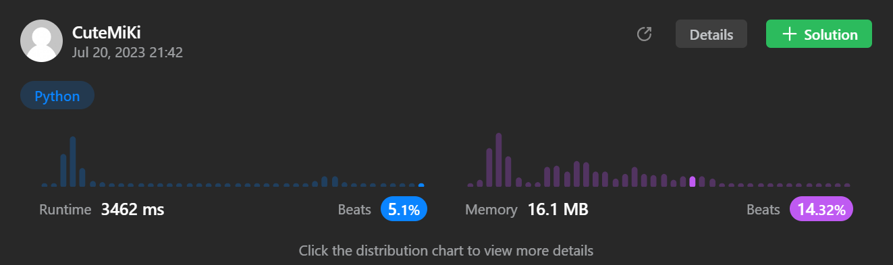

# 125. Valid Palindrome
### Tag: [Easy](https://github.com/TheOnlyMiki/LeetCode-For-Fun/tree/main#easy-level), [Two Pointers](https://github.com/TheOnlyMiki/LeetCode-For-Fun/tree/main#two-pointers), [String](https://github.com/TheOnlyMiki/LeetCode-For-Fun/tree/main#string)
---
<div class="px-5 pt-4"><div class="flex"></div><div class="_1l1MA" data-track-load="description_content"><p>A phrase is a <strong>palindrome</strong> if, after converting all uppercase letters into lowercase letters and removing all non-alphanumeric characters, it reads the same forward and backward. Alphanumeric characters include letters and numbers.</p>

<p>Given a string <code>s</code>, return <code>true</code><em> if it is a <strong>palindrome</strong>, or </em><code>false</code><em> otherwise</em>.</p>

<p>&nbsp;</p>
<p><strong class="example">Example 1:</strong></p>

<pre><strong>Input:</strong> s = "A man, a plan, a canal: Panama"
<strong>Output:</strong> true
<strong>Explanation:</strong> "amanaplanacanalpanama" is a palindrome.
</pre>

<p><strong class="example">Example 2:</strong></p>

<pre><strong>Input:</strong> s = "race a car"
<strong>Output:</strong> false
<strong>Explanation:</strong> "raceacar" is not a palindrome.
</pre>

<p><strong class="example">Example 3:</strong></p>

<pre><strong>Input:</strong> s = " "
<strong>Output:</strong> true
<strong>Explanation:</strong> s is an empty string "" after removing non-alphanumeric characters.
Since an empty string reads the same forward and backward, it is a palindrome.
</pre>

<p>&nbsp;</p>
<p><strong>Constraints:</strong></p>

<ul>
	<li><code>1 &lt;= s.length &lt;= 2 * 10<sup>5</sup></code></li>
	<li><code>s</code> consists only of printable ASCII characters.</li>
</ul>
</div></div>

---


### Solution

```python
class Solution(object):
    def isPalindrome(self, s):
        """
        :type s: str
        :rtype: bool
        """

        n = len(s)

        s = s.lower()
        for c in s:
            if 96 < ord(c) < 123 or 47 < ord(c) < 58:
                s += c

        s = s[n:]
        
        return s == s[::-1]
```
