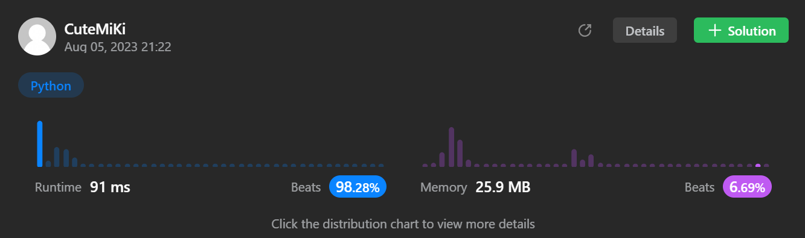

# 127. Word Ladder
### Tag: [Hard](https://github.com/TheOnlyMiki/LeetCode-For-Fun/tree/main#hard-level), [Hash Table](https://github.com/TheOnlyMiki/LeetCode-For-Fun/tree/main#hash-table), [String](https://github.com/TheOnlyMiki/LeetCode-For-Fun/tree/main#string), [Breadth-First Search](https://github.com/TheOnlyMiki/LeetCode-For-Fun/tree/main#breadth-first-search), [Graph](https://github.com/TheOnlyMiki/LeetCode-For-Fun/tree/main#graph)
---
<div class="px-5 pt-4"><div class="flex"></div><div class="xFUwe" data-track-load="description_content"><p>A <strong>transformation sequence</strong> from word <code>beginWord</code> to word <code>endWord</code> using a dictionary <code>wordList</code> is a sequence of words <code>beginWord -&gt; s<sub>1</sub> -&gt; s<sub>2</sub> -&gt; ... -&gt; s<sub>k</sub></code> such that:</p>

<ul>
	<li>Every adjacent pair of words differs by a single letter.</li>
	<li>Every <code>s<sub>i</sub></code> for <code>1 &lt;= i &lt;= k</code> is in <code>wordList</code>. Note that <code>beginWord</code> does not need to be in <code>wordList</code>.</li>
	<li><code>s<sub>k</sub> == endWord</code></li>
</ul>

<p>Given two words, <code>beginWord</code> and <code>endWord</code>, and a dictionary <code>wordList</code>, return <em>the <strong>number of words</strong> in the <strong>shortest transformation sequence</strong> from</em> <code>beginWord</code> <em>to</em> <code>endWord</code><em>, or </em><code>0</code><em> if no such sequence exists.</em></p>

<p>&nbsp;</p>
<p><strong class="example">Example 1:</strong></p>

<pre><strong>Input:</strong> beginWord = "hit", endWord = "cog", wordList = ["hot","dot","dog","lot","log","cog"]
<strong>Output:</strong> 5
<strong>Explanation:</strong> One shortest transformation sequence is "hit" -&gt; "hot" -&gt; "dot" -&gt; "dog" -&gt; cog", which is 5 words long.
</pre>

<p><strong class="example">Example 2:</strong></p>

<pre><strong>Input:</strong> beginWord = "hit", endWord = "cog", wordList = ["hot","dot","dog","lot","log"]
<strong>Output:</strong> 0
<strong>Explanation:</strong> The endWord "cog" is not in wordList, therefore there is no valid transformation sequence.
</pre>

<p>&nbsp;</p>
<p><strong>Constraints:</strong></p>

<ul>
	<li><code>1 &lt;= beginWord.length &lt;= 10</code></li>
	<li><code>endWord.length == beginWord.length</code></li>
	<li><code>1 &lt;= wordList.length &lt;= 5000</code></li>
	<li><code>wordList[i].length == beginWord.length</code></li>
	<li><code>beginWord</code>, <code>endWord</code>, and <code>wordList[i]</code> consist of lowercase English letters.</li>
	<li><code>beginWord != endWord</code></li>
	<li>All the words in <code>wordList</code> are <strong>unique</strong>.</li>
</ul>
</div></div>

---


### Solution

```python
class Solution(object):
    def ladderLength(self, beginWord, endWord, wordList):
        """
        :type beginWord: str
        :type endWord: str
        :type wordList: List[str]
        :rtype: int
        """
        words = [beginWord]
        length = range(len(endWord))
        transform = 1
        next_words = None
        maps = {}
        for word in wordList:
            for i in length:
                word2 = word[:i] + ' ' + word[i+1:]
                if word2 in maps:
                    maps[word2].append(word)
                else:
                    maps[word2] = [word]

        visit = set()
        temp = None
        
        while words:
            next_words = []
            for word in words:
                if word == endWord:
                    return transform

                if word not in visit:
                    visit.add(word)

                    for i in length:
                        temp = word[:i] + ' ' + word[i+1:]
                        if temp in maps:
                            next_words.extend(maps[temp])
                            del maps[temp]

            words = next_words
            transform += 1

        return 0

        # Option 1
        """
        words = [beginWord]
        transform = 1
        next_words = None
        start = end = temp = None
        wordList = set(wordList)
        endCase = {endWord}
        length = range(len(endWord))

        while words:
            next_words = []
            for word in words:
                if word in endCase:
                    return transform
                
                for i in length:
                    start, end = word[:i], word[i+1:]
                    for c in "abcdefghijklmnopqrstuvwxyz":
                        temp = start + c + end
                        if temp in wordList:
                            next_words.append(temp)
                            wordList.remove(temp)

            words = next_words
            transform += 1

        return 0
        """
```
