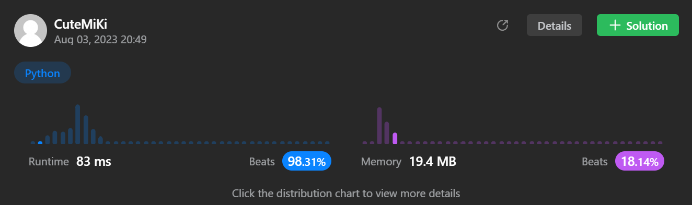

# 130. Surrounded Regions
### Tag: [Medium](https://github.com/TheOnlyMiki/LeetCode-For-Fun/tree/main#medium-level), [Array](https://github.com/TheOnlyMiki/LeetCode-For-Fun/tree/main#array), [Depth-First Search](https://github.com/TheOnlyMiki/LeetCode-For-Fun/tree/main#depth-first-search), [Breadth-First Search](https://github.com/TheOnlyMiki/LeetCode-For-Fun/tree/main#breadth-first-search), [Union Find](https://github.com/TheOnlyMiki/LeetCode-For-Fun/tree/main#union-find), [Matrix](https://github.com/TheOnlyMiki/LeetCode-For-Fun/tree/main#matrix), [Graph](https://github.com/TheOnlyMiki/LeetCode-For-Fun/tree/main#graph)
---
<div class="px-5 pt-4"><div class="flex"></div><div class="xFUwe" data-track-load="description_content"><p>Given an <code>m x n</code> matrix <code>board</code> containing <code>'X'</code> and <code>'O'</code>, <em>capture all regions that are 4-directionally&nbsp;surrounded by</em> <code>'X'</code>.</p>

<p>A region is <strong>captured</strong> by flipping all <code>'O'</code>s into <code>'X'</code>s in that surrounded region.</p>

<p>&nbsp;</p>
<p><strong class="example">Example 1:</strong></p>

<pre><strong>Input:</strong> board = [["X","X","X","X"],["X","O","O","X"],["X","X","O","X"],["X","O","X","X"]]
<strong>Output:</strong> [["X","X","X","X"],["X","X","X","X"],["X","X","X","X"],["X","O","X","X"]]
<strong>Explanation:</strong> Notice that an 'O' should not be flipped if:
- It is on the border, or
- It is adjacent to an 'O' that should not be flipped.
The bottom 'O' is on the border, so it is not flipped.
The other three 'O' form a surrounded region, so they are flipped.
</pre>

<p><strong class="example">Example 2:</strong></p>

<pre><strong>Input:</strong> board = [["X"]]
<strong>Output:</strong> [["X"]]
</pre>

<p>&nbsp;</p>
<p><strong>Constraints:</strong></p>

<ul>
	<li><code>m == board.length</code></li>
	<li><code>n == board[i].length</code></li>
	<li><code>1 &lt;= m, n &lt;= 200</code></li>
	<li><code>board[i][j]</code> is <code>'X'</code> or <code>'O'</code>.</li>
</ul>
</div></div>

---


### Solution

```python
class Solution(object):
    def solve(self, board):
        """
        :type board: List[List[str]]
        :rtype: None Do not return anything, modify board in-place instead.
        """

        self.m = len(board)
        self.n = len(board[0])
        rows = range(self.m)
        cols = range(self.n)

        self.alives = set()

        def markO(neighbors):
            for x, y in neighbors:
                if x == -1 or x == self.m or y == -1 or y == self.n or (x,y) in self.alives:
                    continue 
                elif board[x][y] == 'O':
                    self.alives.add((x, y))
                    markO([(x-1, y), (x, y-1), (x, y+1), (x+1, y)])

        # First and Last Rows
        last = self.m-1
        for y in cols:
            if board[0][y] == 'O' and (0, y) not in self.alives:
                self.alives.add((0, y))
                markO([(1, y)])
            if board[last][y] == 'O' and (last, y) not in self.alives:
                self.alives.add((last, y))
                markO([(last-1, y)])

        # First and Last Cols
        last = self.n-1
        for x in rows:
            if board[x][0] == 'O' and (x, 0) not in self.alives:
                self.alives.add((x, 0))
                markO([(x, 1)])
            if board[x][last] == 'O' and (x, last) not in self.alives:
                self.alives.add((x, last))
                markO([(x, last-1)])

        for x in rows:
            for y in cols:
                if board[x][y] == 'O' and (x, y) not in self.alives:
                    board[x][y] = 'X'
```
