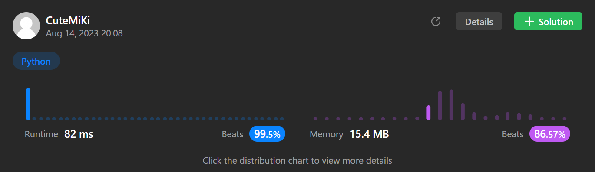

# 136. Single Number
### Tag: [Easy](https://github.com/TheOnlyMiki/LeetCode-For-Fun/tree/main#easy-level), [Array](https://github.com/TheOnlyMiki/LeetCode-For-Fun/tree/main#array), [Bit Manipulation](https://github.com/TheOnlyMiki/LeetCode-For-Fun/tree/main#bit-manipulation)
---
<div class="px-5 pt-4"><div class="flex"></div><div class="xFUwe" data-track-load="description_content"><p>Given a <strong>non-empty</strong>&nbsp;array of integers <code>nums</code>, every element appears <em>twice</em> except for one. Find that single one.</p>

<p>You must&nbsp;implement a solution with a linear runtime complexity and use&nbsp;only constant&nbsp;extra space.</p>

<p>&nbsp;</p>
<p><strong class="example">Example 1:</strong></p>
<pre><strong>Input:</strong> nums = [2,2,1]
<strong>Output:</strong> 1
</pre><p><strong class="example">Example 2:</strong></p>
<pre><strong>Input:</strong> nums = [4,1,2,1,2]
<strong>Output:</strong> 4
</pre><p><strong class="example">Example 3:</strong></p>
<pre><strong>Input:</strong> nums = [1]
<strong>Output:</strong> 1
</pre>
<p>&nbsp;</p>
<p><strong>Constraints:</strong></p>

<ul>
	<li><code>1 &lt;= nums.length &lt;= 3 * 10<sup>4</sup></code></li>
	<li><code>-3 * 10<sup>4</sup> &lt;= nums[i] &lt;= 3 * 10<sup>4</sup></code></li>
	<li>Each element in the array appears twice except for one element which appears only once.</li>
</ul>
</div></div>

---


### Solution

```python
class Solution(object):
    def singleNumber(self, nums):
        """
        :type nums: List[int]
        :rtype: int
        """
        # Option 2 - XOR: A^A^B = 0^B = B
        output = 0
        for num in nums:
            output ^= num

        return output

        # Option 1 - Time O(n) Space O(n)
        record = set()
        for num in nums:
            if num in record:
                record.remove(num)
            else:
                record.add(num)
        
        return record.pop()
```
