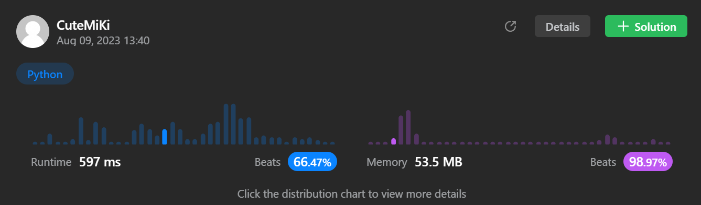

# 148. Sort List
### Tag: [Medium](https://github.com/TheOnlyMiki/LeetCode-For-Fun/tree/main#medium-level), [Linked List](https://github.com/TheOnlyMiki/LeetCode-For-Fun/tree/main#linked-list), [Two Pointers](https://github.com/TheOnlyMiki/LeetCode-For-Fun/tree/main#two-pointers), [Divide and Conquer](https://github.com/TheOnlyMiki/LeetCode-For-Fun/tree/main#divide-and-conquer), [Sorting](https://github.com/TheOnlyMiki/LeetCode-For-Fun/tree/main#sorting)
---
<div class="px-5 pt-4"><div class="flex"></div><div class="xFUwe" data-track-load="description_content"><p>Given the <code>head</code> of a linked list, return <em>the list after sorting it in <strong>ascending order</strong></em>.</p>

<p>&nbsp;</p>
<p><strong class="example">Example 1:</strong></p>

<pre><strong>Input:</strong> head = [4,2,1,3]
<strong>Output:</strong> [1,2,3,4]
</pre>

<p><strong class="example">Example 2:</strong></p>

<pre><strong>Input:</strong> head = [-1,5,3,4,0]
<strong>Output:</strong> [-1,0,3,4,5]
</pre>

<p><strong class="example">Example 3:</strong></p>

<pre><strong>Input:</strong> head = []
<strong>Output:</strong> []
</pre>

<p>&nbsp;</p>
<p><strong>Constraints:</strong></p>

<ul>
	<li>The number of nodes in the list is in the range <code>[0, 5 * 10<sup>4</sup>]</code>.</li>
	<li><code>-10<sup>5</sup> &lt;= Node.val &lt;= 10<sup>5</sup></code></li>
</ul>

<p>&nbsp;</p>
<p><strong>Follow up:</strong> Can you sort the linked list in <code>O(n logn)</code> time and <code>O(1)</code> memory (i.e. constant space)?</p>
</div></div>

---


### Solution

```python
# Definition for singly-linked list.
# class ListNode(object):
#     def __init__(self, val=0, next=None):
#         self.val = val
#         self.next = next
class Solution(object):
    def sortList(self, head):
        """
        :type head: ListNode
        :rtype: ListNode
        """
        if not head:
            return None

        def merge(left, right):
            if not left:
                return right
            if not right:
                return left

            head, temp, left, right = (left, left, left.next, right) if left.val < right.val else (right, right, left, right.next)
            while left and right:
                if left.val < right.val:
                    temp.next = left
                    left = left.next
                else:
                    temp.next = right
                    right = right.next
                temp = temp.next

            temp.next = left if left else right

            return head

        def mergeSort(node):
            if not node or not node.next: 
                return node

            slow = fast = node
            while fast.next and fast.next.next:
                slow = slow.next
                fast = fast.next.next

            right = slow.next
            slow.next = None

            return merge(mergeSort(node), mergeSort(right))

        return mergeSort(head)
```
