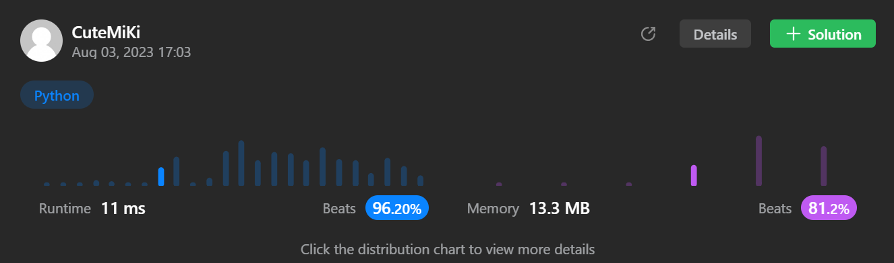

# 199. Binary Tree Right Side View
### Tag: [Medium](https://github.com/TheOnlyMiki/LeetCode-For-Fun/tree/main#medium-level), [Depth-First Search](https://github.com/TheOnlyMiki/LeetCode-For-Fun/tree/main#depth-first-search), [Breadth-First Search](https://github.com/TheOnlyMiki/LeetCode-For-Fun/tree/main#breadth-first-search), [Binary Tree](https://github.com/TheOnlyMiki/LeetCode-For-Fun/tree/main#binary-tree)
---
<div class="px-5 pt-4"><div class="flex"></div><div class="_1l1MA" data-track-load="description_content"><p>Given the <code>root</code> of a binary tree, imagine yourself standing on the <strong>right side</strong> of it, return <em>the values of the nodes you can see ordered from top to bottom</em>.</p>

<p>&nbsp;</p>
<p><strong class="example">Example 1:</strong></p>

<pre><strong>Input:</strong> root = [1,2,3,null,5,null,4]
<strong>Output:</strong> [1,3,4]
</pre>

<p><strong class="example">Example 2:</strong></p>

<pre><strong>Input:</strong> root = [1,null,3]
<strong>Output:</strong> [1,3]
</pre>

<p><strong class="example">Example 3:</strong></p>

<pre><strong>Input:</strong> root = []
<strong>Output:</strong> []
</pre>

<p>&nbsp;</p>
<p><strong>Constraints:</strong></p>

<ul>
	<li>The number of nodes in the tree is in the range <code>[0, 100]</code>.</li>
	<li><code>-100 &lt;= Node.val &lt;= 100</code></li>
</ul>
</div></div>

---


### Solution

```python
# Definition for a binary tree node.
# class TreeNode(object):
#     def __init__(self, val=0, left=None, right=None):
#         self.val = val
#         self.left = left
#         self.right = right
class Solution(object):
    def rightSideView(self, root):
        """
        :type root: TreeNode
        :rtype: List[int]
        """
        if not root:
            return []

        output = [root.val]
        nodes = [root]
        next_level = None

        while nodes:
            next_level = []
            for node in nodes:
                if node.left:
                    next_level.append(node.left)
                if node.right:
                    next_level.append(node.right)
            nodes = next_level
            if next_level:
                output.append(next_level[-1].val)

        return output
```
