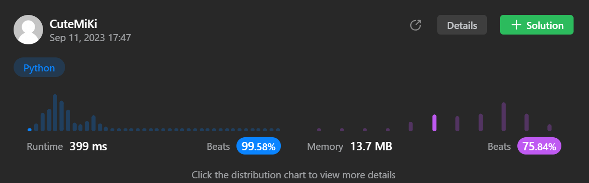

# 1004. Max Consecutive Ones III
### Tag: [Medium](https://github.com/TheOnlyMiki/LeetCode-For-Fun/tree/main#medium-level), [Array](https://github.com/TheOnlyMiki/LeetCode-For-Fun/tree/main#array), [Binary Search](https://github.com/TheOnlyMiki/LeetCode-For-Fun/tree/main#binary-search), [Sliding Window](https://github.com/TheOnlyMiki/LeetCode-For-Fun/tree/main#sliding-window), [Prefix Sum](https://github.com/TheOnlyMiki/LeetCode-For-Fun/tree/main#prefix-sum)
---
<div class="px-5 pt-4"><div class="flex"></div><div class="xFUwe" data-track-load="description_content"><p>Given a binary array <code>nums</code> and an integer <code>k</code>, return <em>the maximum number of consecutive </em><code>1</code><em>'s in the array if you can flip at most</em> <code>k</code> <code>0</code>'s.</p>

<p>&nbsp;</p>
<p><strong class="example">Example 1:</strong></p>

<pre><strong>Input:</strong> nums = [1,1,1,0,0,0,1,1,1,1,0], k = 2
<strong>Output:</strong> 6
<strong>Explanation:</strong> [1,1,1,0,0,<u><strong>1</strong>,1,1,1,1,<strong>1</strong></u>]
Bolded numbers were flipped from 0 to 1. The longest subarray is underlined.</pre>

<p><strong class="example">Example 2:</strong></p>

<pre><strong>Input:</strong> nums = [0,0,1,1,0,0,1,1,1,0,1,1,0,0,0,1,1,1,1], k = 3
<strong>Output:</strong> 10
<strong>Explanation:</strong> [0,0,<u>1,1,<strong>1</strong>,<strong>1</strong>,1,1,1,<strong>1</strong>,1,1</u>,0,0,0,1,1,1,1]
Bolded numbers were flipped from 0 to 1. The longest subarray is underlined.
</pre>

<p>&nbsp;</p>
<p><strong>Constraints:</strong></p>

<ul>
	<li><code>1 &lt;= nums.length &lt;= 10<sup>5</sup></code></li>
	<li><code>nums[i]</code> is either <code>0</code> or <code>1</code>.</li>
	<li><code>0 &lt;= k &lt;= nums.length</code></li>
</ul>
</div></div>

---


### Solution

```python
class Solution(object):
    def longestOnes(self, nums, k):
        """
        :type nums: List[int]
        :type k: int
        :rtype: int
        """
        # Option 2
        index = 0
        for i, num in enumerate(nums):
            if num == 0:
                k -= 1

            if k < 0:
                if nums[index] == 0:
                    k += 1
                index += 1

        return len(nums) - index

        # Option 1 - Cannot pass, over time
        """
        length = len(nums)
        i = output = 0
        temp = count = None

        if k == 0:
            while i < length:
                if nums[i] == 1:
                    temp, count = i, 0
                    while i < length and nums[i] == 1:
                        i += 1

                    if i - temp > output:
                        output = i - temp

                i += 1

            return output

        record = [None] * k

        while i < length:
            temp, count = i, 0
            while i < length and (count < k or nums[i] == 1):
                if nums[i] == 0:
                    record[count] = i
                    count += 1
                i += 1

            if i - temp > output:
                output = i - temp
            if i == length:
                break

            i = record[0] + 1

        return output
        """
```
