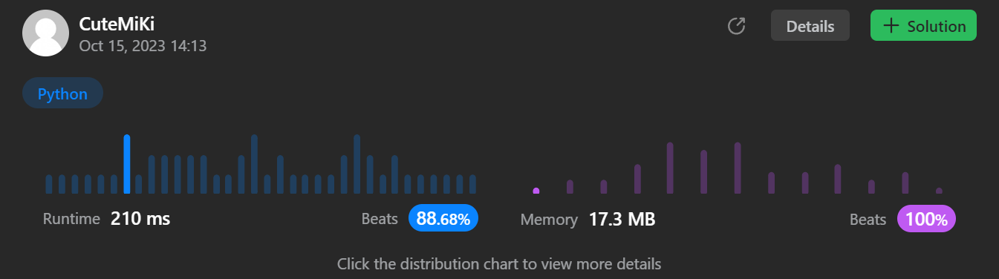

# 1019. Next Greater Node In Linked List
### Tag: [Medium](https://github.com/TheOnlyMiki/LeetCode-For-Fun/tree/main#medium-level), [Array](https://github.com/TheOnlyMiki/LeetCode-For-Fun/tree/main#array), [Linked List](https://github.com/TheOnlyMiki/LeetCode-For-Fun/tree/main#linked-list), [Stack](https://github.com/TheOnlyMiki/LeetCode-For-Fun/tree/main#stack)
---
<div class="px-5 pt-4"><div class="flex"></div><div class="xFUwe" data-track-load="description_content"><p>You are given the <code>head</code> of a linked list with <code>n</code> nodes.</p>

<p>For each node in the list, find the value of the <strong>next greater node</strong>. That is, for each node, find the value of the first node that is next to it and has a <strong>strictly larger</strong> value than it.</p>

<p>Return an integer array <code>answer</code> where <code>answer[i]</code> is the value of the next greater node of the <code>i<sup>th</sup></code> node (<strong>1-indexed</strong>). If the <code>i<sup>th</sup></code> node does not have a next greater node, set <code>answer[i] = 0</code>.</p>

<p>&nbsp;</p>
<p><strong class="example">Example 1:</strong></p>

<pre><strong>Input:</strong> head = [2,1,5]
<strong>Output:</strong> [5,5,0]
</pre>

<p><strong class="example">Example 2:</strong></p>

<pre><strong>Input:</strong> head = [2,7,4,3,5]
<strong>Output:</strong> [7,0,5,5,0]
</pre>

<p>&nbsp;</p>
<p><strong>Constraints:</strong></p>

<ul>
	<li>The number of nodes in the list is <code>n</code>.</li>
	<li><code>1 &lt;= n &lt;= 10<sup>4</sup></code></li>
	<li><code>1 &lt;= Node.val &lt;= 10<sup>9</sup></code></li>
</ul>
</div></div>

---


### Solution

```python
# Definition for singly-linked list.
# class ListNode(object):
#     def __init__(self, val=0, next=None):
#         self.val = val
#         self.next = next
class Solution(object):
    def nextLargerNodes(self, head):
        """
        :type head: ListNode
        :rtype: List[int]
        """
        # Option 2 - Traversal only one time for linked list
        """
        output, stack = [], []
        while head:
            while stack and stack[-1][0] < head.val:
                output[stack.pop()[1]] = head.val
            
            stack.append([head.val, len(output)])
            output.append(0)
            head = head.next

        return output
        """

        # Option 1 - Reverse the linked list then traversal, this saves a lot of memory spaces
        previou, i = None, 0
        while head:
            head.next, head, previou, i = previou, head.next, head, i+1

        output, stack, i = [0]*i, [], i-1
        while previou:
            while stack and stack[-1] <= previou.val:
                stack.pop()

            if stack:
                output[i] = stack[-1]

            stack.append(previou.val)
            i, previou = i-1, previou.next
        
        return output
```
