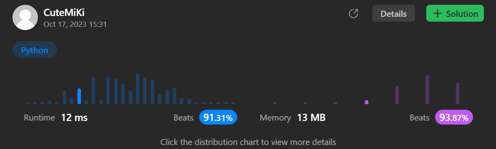

# 1051. Height Checker
### Tag: [Easy](https://github.com/TheOnlyMiki/LeetCode-For-Fun/tree/main#easy-level), [Array](https://github.com/TheOnlyMiki/LeetCode-For-Fun/tree/main#array), [Sorting](https://github.com/TheOnlyMiki/LeetCode-For-Fun/tree/main#sorting)
---
<div class="px-5 pt-4"><div class="flex"></div><div class="xFUwe" data-track-load="description_content"><p>A school is trying to take an annual photo of all the students. The students are asked to stand in a single file line in <strong>non-decreasing order</strong> by height. Let this ordering be represented by the integer array <code>expected</code> where <code>expected[i]</code> is the expected height of the <code>i<sup>th</sup></code> student in line.</p>

<p>You are given an integer array <code>heights</code> representing the <strong>current order</strong> that the students are standing in. Each <code>heights[i]</code> is the height of the <code>i<sup>th</sup></code> student in line (<strong>0-indexed</strong>).</p>

<p>Return <em>the <strong>number of indices</strong> where </em><code>heights[i] != expected[i]</code>.</p>

<p>&nbsp;</p>
<p><strong class="example">Example 1:</strong></p>

<pre><strong>Input:</strong> heights = [1,1,4,2,1,3]
<strong>Output:</strong> 3
<strong>Explanation:</strong> 
heights:  [1,1,<u>4</u>,2,<u>1</u>,<u>3</u>]
expected: [1,1,<u>1</u>,2,<u>3</u>,<u>4</u>]
Indices 2, 4, and 5 do not match.
</pre>

<p><strong class="example">Example 2:</strong></p>

<pre><strong>Input:</strong> heights = [5,1,2,3,4]
<strong>Output:</strong> 5
<strong>Explanation:</strong>
heights:  [<u>5</u>,<u>1</u>,<u>2</u>,<u>3</u>,<u>4</u>]
expected: [<u>1</u>,<u>2</u>,<u>3</u>,<u>4</u>,<u>5</u>]
All indices do not match.
</pre>

<p><strong class="example">Example 3:</strong></p>

<pre><strong>Input:</strong> heights = [1,2,3,4,5]
<strong>Output:</strong> 0
<strong>Explanation:</strong>
heights:  [1,2,3,4,5]
expected: [1,2,3,4,5]
All indices match.
</pre>

<p>&nbsp;</p>
<p><strong>Constraints:</strong></p>

<ul>
	<li><code>1 &lt;= heights.length &lt;= 100</code></li>
	<li><code>1 &lt;= heights[i] &lt;= 100</code></li>
</ul>
</div></div>

---


### Solution

```python
class Solution(object):
    def heightChecker(self, heights):
        """
        :type heights: List[int]
        :rtype: int
        """
        # Option 1 - Hash Table method, Time O(n)
        record = {}
        for n in heights:
            record[n] = record[n]+1 if n in record else 1

        count, num = 0, 1
        for n in heights:
            while num not in record:
                num += 1

            if n != num:
                count += 1

            record[num] -= 1
            if record[num] == 0:
                num += 1

        return count

        # Option 1 - Sorting method
        """
        correct = sorted(heights)
        count = 0
        for p1, p2 in zip(heights, correct):
            if p1 != p2:
                count += 1

        return count
        """
```
