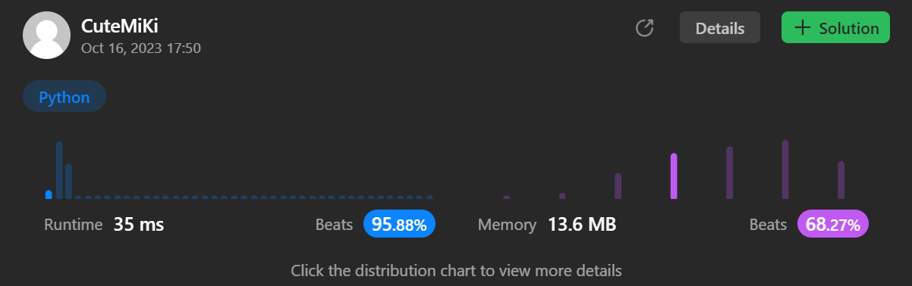

# 1089. Duplicate Zeros
### Tag: [Easy](https://github.com/TheOnlyMiki/LeetCode-For-Fun/tree/main#easy-level), [Array](https://github.com/TheOnlyMiki/LeetCode-For-Fun/tree/main#array), [Two Pointers](https://github.com/TheOnlyMiki/LeetCode-For-Fun/tree/main#two-pointers)
---
<div class="px-5 pt-4"><div class="flex"></div><div class="xFUwe" data-track-load="description_content"><p>Given a fixed-length integer array <code>arr</code>, duplicate each occurrence of zero, shifting the remaining elements to the right.</p>

<p><strong>Note</strong> that elements beyond the length of the original array are not written. Do the above modifications to the input array in place and do not return anything.</p>

<p>&nbsp;</p>
<p><strong class="example">Example 1:</strong></p>

<pre><strong>Input:</strong> arr = [1,0,2,3,0,4,5,0]
<strong>Output:</strong> [1,0,0,2,3,0,0,4]
<strong>Explanation:</strong> After calling your function, the input array is modified to: [1,0,0,2,3,0,0,4]
</pre>

<p><strong class="example">Example 2:</strong></p>

<pre><strong>Input:</strong> arr = [1,2,3]
<strong>Output:</strong> [1,2,3]
<strong>Explanation:</strong> After calling your function, the input array is modified to: [1,2,3]
</pre>

<p>&nbsp;</p>
<p><strong>Constraints:</strong></p>

<ul>
	<li><code>1 &lt;= arr.length &lt;= 10<sup>4</sup></code></li>
	<li><code>0 &lt;= arr[i] &lt;= 9</code></li>
</ul>
</div></div>

---


### Solution

```python
class Solution(object):
    def duplicateZeros(self, arr):
        """
        :type arr: List[int]
        :rtype: None Do not return anything, modify arr in-place instead.
        """
        # Option 2 - In place
        for i in range(len(arr)-2, -1, -1):
            if arr[i] == 0:
                arr[i+1:] = arr[i:-1]

        """
        length = len(arr)-1
        for i in range(length, -1, -1):
            if arr[i] == 0:
                for i2 in range(length, i, -1):
                    arr[i2] = arr[i2-1]
        """

        # Option 1 - extra spaces
        """
        i, length, output = 0, len(arr), []
        while len(output) < length:
            if arr[i] == 0:
                output.append(0)

            output.append(arr[i])
            i += 1

        arr[:] = output[:length]
        """
```
