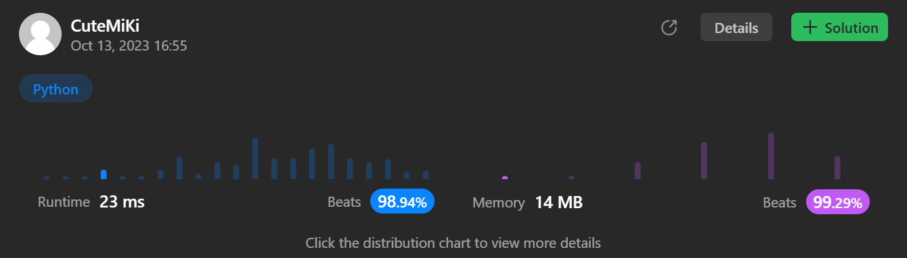

# 1095. Find in Mountain Array
### Tag: [Hard](https://github.com/TheOnlyMiki/LeetCode-For-Fun/tree/main#hard-level), [Array](https://github.com/TheOnlyMiki/LeetCode-For-Fun/tree/main#array), [Binary Search](https://github.com/TheOnlyMiki/LeetCode-For-Fun/tree/main#binary-search)
---
<div class="px-5 pt-4"><div class="flex"></div><div class="xFUwe" data-track-load="description_content"><p><em>(This problem is an <strong>interactive problem</strong>.)</em></p>

<p>You may recall that an array <code>arr</code> is a <strong>mountain array</strong> if and only if:</p>

<ul>
	<li><code>arr.length &gt;= 3</code></li>
	<li>There exists some <code>i</code> with <code>0 &lt; i &lt; arr.length - 1</code> such that:
	<ul>
		<li><code>arr[0] &lt; arr[1] &lt; ... &lt; arr[i - 1] &lt; arr[i]</code></li>
		<li><code>arr[i] &gt; arr[i + 1] &gt; ... &gt; arr[arr.length - 1]</code></li>
	</ul>
	</li>
</ul>

<p>Given a mountain array <code>mountainArr</code>, return the <strong>minimum</strong> <code>index</code> such that <code>mountainArr.get(index) == target</code>. If such an <code>index</code> does not exist, return <code>-1</code>.</p>

<p><strong>You cannot access the mountain array directly.</strong> You may only access the array using a <code>MountainArray</code> interface:</p>

<ul>
	<li><code>MountainArray.get(k)</code> returns the element of the array at index <code>k</code> (0-indexed).</li>
	<li><code>MountainArray.length()</code> returns the length of the array.</li>
</ul>

<p>Submissions making more than <code>100</code> calls to <code>MountainArray.get</code> will be judged <em>Wrong Answer</em>. Also, any solutions that attempt to circumvent the judge will result in disqualification.</p>

<p>&nbsp;</p>
<p><strong class="example">Example 1:</strong></p>

<pre><strong>Input:</strong> array = [1,2,3,4,5,3,1], target = 3
<strong>Output:</strong> 2
<strong>Explanation:</strong> 3 exists in the array, at index=2 and index=5. Return the minimum index, which is 2.</pre>

<p><strong class="example">Example 2:</strong></p>

<pre><strong>Input:</strong> array = [0,1,2,4,2,1], target = 3
<strong>Output:</strong> -1
<strong>Explanation:</strong> 3 does not exist in <code>the array,</code> so we return -1.
</pre>

<p>&nbsp;</p>
<p><strong>Constraints:</strong></p>

<ul>
	<li><code>3 &lt;= mountain_arr.length() &lt;= 10<sup>4</sup></code></li>
	<li><code>0 &lt;= target &lt;= 10<sup>9</sup></code></li>
	<li><code>0 &lt;= mountain_arr.get(index) &lt;= 10<sup>9</sup></code></li>
</ul>
</div></div>

---


### Solution

```python
# """
# This is MountainArray's API interface.
# You should not implement it, or speculate about its implementation
# """
#class MountainArray(object):
#    def get(self, index):
#        """
#        :type index: int
#        :rtype int
#        """
#
#    def length(self):
#        """
#        :rtype int
#        """

class Solution(object):
    def findInMountainArray(self, target, mountain_arr):
        """
        :type target: integer
        :type mountain_arr: MountainArray
        :rtype: integer
        """
        # Option 2 - Same as Option 1
        """
        def findIndexIncrease(left, right):
            if left <= right:
                mid = (left + right) >> 1
                current = mountain_arr.get(mid)

                if current > target:
                    return findIndexIncrease(left, mid-1)
                elif current < target:
                    return findIndexIncrease(mid+1, right)
                else:
                    return mid

            return -1

        def findIndexDecrease(left, right):
            if left <= right:
                mid = (left + right) >> 1
                current = mountain_arr.get(mid)

                if current > target:
                    return findIndexDecrease(mid+1, right)
                elif current < target:
                    return findIndexDecrease(left, mid-1)
                else:
                    return mid

            return -1

        l, r = 0, mountain_arr.length()-1
        while l < r:
            mid = (l + r) >> 1
            if mountain_arr.get(mid) < mountain_arr.get(mid+1):
                l = mid+1
            else:
                r = mid

        output = findIndexIncrease(0, l)
        return output if output != -1 else findIndexDecrease(l+1, mountain_arr.length()-1)
        """

        # Option 1 - Find the higher point in the array, then find the index from two part
        # Left part if increase order, right part is decrease order
        l, r = 0, mountain_arr.length()-1
        while l < r:
            mid = (l + r) // 2
            if mountain_arr.get(mid) < mountain_arr.get(mid+1):
                l = mid+1
            else:
                r = mid

        left, right = 0, l
        while left <= right:
            mid = (left + right) // 2
            current = mountain_arr.get(mid)

            if current > target:
                right = mid-1
            elif current < target:
                left = mid+1
            else:
                return mid

        left, right = l+1, mountain_arr.length()-1
        while left <= right:
            mid = (left + right) // 2
            current = mountain_arr.get(mid)

            if current > target:
                left = mid+1
            elif current < target:
                right = mid-1
            else:
                return mid

        return -1
```
