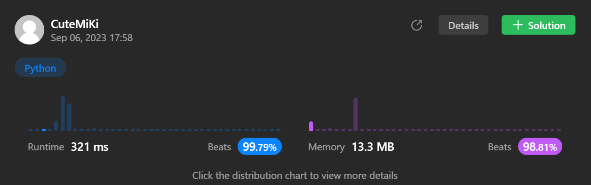

# 1143. Longest Common Subsequence
### Tag: [Medium](https://github.com/TheOnlyMiki/LeetCode-For-Fun/tree/main#medium-level), [String](https://github.com/TheOnlyMiki/LeetCode-For-Fun/tree/main#string), [Dynamic Programming](https://github.com/TheOnlyMiki/LeetCode-For-Fun/tree/main#dynamic-programming)
---
<div class="px-5 pt-4"><div class="flex"></div><div class="xFUwe" data-track-load="description_content"><p>Given two strings <code>text1</code> and <code>text2</code>, return <em>the length of their longest <strong>common subsequence</strong>. </em>If there is no <strong>common subsequence</strong>, return <code>0</code>.</p>

<p>A <strong>subsequence</strong> of a string is a new string generated from the original string with some characters (can be none) deleted without changing the relative order of the remaining characters.</p>

<ul>
	<li>For example, <code>"ace"</code> is a subsequence of <code>"abcde"</code>.</li>
</ul>

<p>A <strong>common subsequence</strong> of two strings is a subsequence that is common to both strings.</p>

<p>&nbsp;</p>
<p><strong class="example">Example 1:</strong></p>

<pre><strong>Input:</strong> text1 = "abcde", text2 = "ace" 
<strong>Output:</strong> 3  
<strong>Explanation:</strong> The longest common subsequence is "ace" and its length is 3.
</pre>

<p><strong class="example">Example 2:</strong></p>

<pre><strong>Input:</strong> text1 = "abc", text2 = "abc"
<strong>Output:</strong> 3
<strong>Explanation:</strong> The longest common subsequence is "abc" and its length is 3.
</pre>

<p><strong class="example">Example 3:</strong></p>

<pre><strong>Input:</strong> text1 = "abc", text2 = "def"
<strong>Output:</strong> 0
<strong>Explanation:</strong> There is no such common subsequence, so the result is 0.
</pre>

<p>&nbsp;</p>
<p><strong>Constraints:</strong></p>

<ul>
	<li><code>1 &lt;= text1.length, text2.length &lt;= 1000</code></li>
	<li><code>text1</code> and <code>text2</code> consist of only lowercase English characters.</li>
</ul>
</div></div>

---


### Solution

```python
class Solution(object):
    def longestCommonSubsequence(self, text1, text2):
        """
        :type text1: str
        :type text2: str
        :rtype: int
        """
        len1, len2 = len(text1), len(text2)+1
        cols = range(len2-1)
        record1 = [0] * len2
        record2 = c = None

        for c in text1:
            record2 = [0] * len2
            for j in cols:
                record2[j] = record1[j-1]+1 if c == text2[j] else max(record1[j], record2[j-1])

            record1 = record2

        return record1[len2-2]
```
