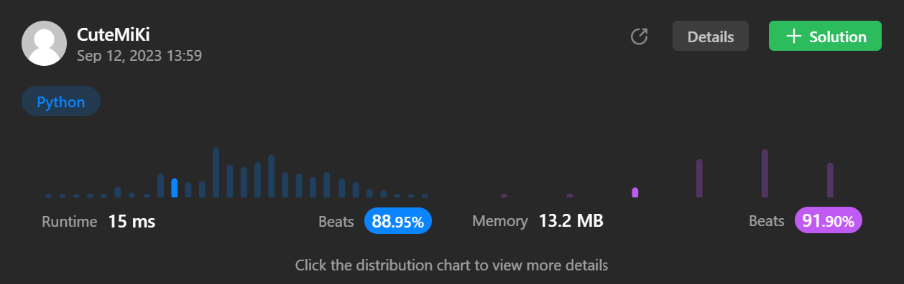

# 1207. Unique Number of Occurrences
### Tag: [Easy](https://github.com/TheOnlyMiki/LeetCode-For-Fun/tree/main#easy-level), [Array](https://github.com/TheOnlyMiki/LeetCode-For-Fun/tree/main#array), [Hash Table](https://github.com/TheOnlyMiki/LeetCode-For-Fun/tree/main#hash-table)
---
<div class="px-5 pt-4"><div class="flex"></div><div class="xFUwe" data-track-load="description_content"><p>Given an array of integers <code>arr</code>, return <code>true</code> <em>if the number of occurrences of each value in the array is <strong>unique</strong> or </em><code>false</code><em> otherwise</em>.</p>

<p>&nbsp;</p>
<p><strong class="example">Example 1:</strong></p>

<pre><strong>Input:</strong> arr = [1,2,2,1,1,3]
<strong>Output:</strong> true
<strong>Explanation:</strong>&nbsp;The value 1 has 3 occurrences, 2 has 2 and 3 has 1. No two values have the same number of occurrences.</pre>

<p><strong class="example">Example 2:</strong></p>

<pre><strong>Input:</strong> arr = [1,2]
<strong>Output:</strong> false
</pre>

<p><strong class="example">Example 3:</strong></p>

<pre><strong>Input:</strong> arr = [-3,0,1,-3,1,1,1,-3,10,0]
<strong>Output:</strong> true
</pre>

<p>&nbsp;</p>
<p><strong>Constraints:</strong></p>

<ul>
	<li><code>1 &lt;= arr.length &lt;= 1000</code></li>
	<li><code>-1000 &lt;= arr[i] &lt;= 1000</code></li>
</ul>
</div></div>

---


### Solution

```python
class Solution(object):
    def uniqueOccurrences(self, arr):
        """
        :type arr: List[int]
        :rtype: bool
        """
        # Option 2
        """
        visit = set()
        temp = None
        for num in set(arr):
            temp = arr.count(num)
            if temp in visit:
                return False
            visit.add(temp)

        return True
        """

        # Option 1
        count = {}
        for num in arr:
            if num in count:
                count[num] += 1
            else:
                count[num] = 1

        return len(count) == len(set(count.values()))
```
