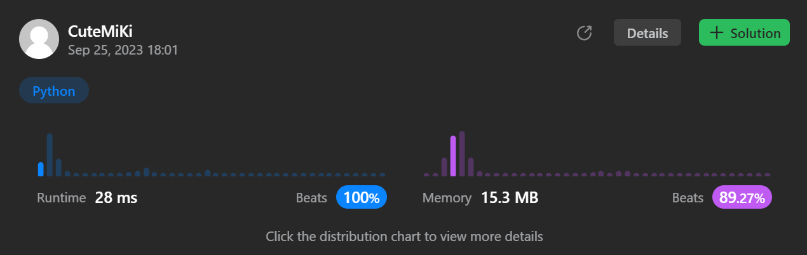

# 1268. Search Suggestions System
### Tag: [Medium](https://github.com/TheOnlyMiki/LeetCode-For-Fun/tree/main#medium-level), [Array](https://github.com/TheOnlyMiki/LeetCode-For-Fun/tree/main#array), [String](https://github.com/TheOnlyMiki/LeetCode-For-Fun/tree/main#string), [Binary Search](https://github.com/TheOnlyMiki/LeetCode-For-Fun/tree/main#binary-search), [Trie](https://github.com/TheOnlyMiki/LeetCode-For-Fun/tree/main#trie), [Sorting](https://github.com/TheOnlyMiki/LeetCode-For-Fun/tree/main#sorting), [Queue](https://github.com/TheOnlyMiki/LeetCode-For-Fun/tree/main#queue)
---
<div class="px-5 pt-4"><div class="flex"></div><div class="xFUwe" data-track-load="description_content"><p>You are given an array of strings <code>products</code> and a string <code>searchWord</code>.</p>

<p>Design a system that suggests at most three product names from <code>products</code> after each character of <code>searchWord</code> is typed. Suggested products should have common prefix with <code>searchWord</code>. If there are more than three products with a common prefix return the three lexicographically minimums products.</p>

<p>Return <em>a list of lists of the suggested products after each character of </em><code>searchWord</code><em> is typed</em>.</p>

<p>&nbsp;</p>
<p><strong class="example">Example 1:</strong></p>

<pre><strong>Input:</strong> products = ["mobile","mouse","moneypot","monitor","mousepad"], searchWord = "mouse"
<strong>Output:</strong> [["mobile","moneypot","monitor"],["mobile","moneypot","monitor"],["mouse","mousepad"],["mouse","mousepad"],["mouse","mousepad"]]
<strong>Explanation:</strong> products sorted lexicographically = ["mobile","moneypot","monitor","mouse","mousepad"].
After typing m and mo all products match and we show user ["mobile","moneypot","monitor"].
After typing mou, mous and mouse the system suggests ["mouse","mousepad"].
</pre>

<p><strong class="example">Example 2:</strong></p>

<pre><strong>Input:</strong> products = ["havana"], searchWord = "havana"
<strong>Output:</strong> [["havana"],["havana"],["havana"],["havana"],["havana"],["havana"]]
<strong>Explanation:</strong> The only word "havana" will be always suggested while typing the search word.
</pre>

<p>&nbsp;</p>
<p><strong>Constraints:</strong></p>

<ul>
	<li><code>1 &lt;= products.length &lt;= 1000</code></li>
	<li><code>1 &lt;= products[i].length &lt;= 3000</code></li>
	<li><code>1 &lt;= sum(products[i].length) &lt;= 2 * 10<sup>4</sup></code></li>
	<li>All the strings of <code>products</code> are <strong>unique</strong>.</li>
	<li><code>products[i]</code> consists of lowercase English letters.</li>
	<li><code>1 &lt;= searchWord.length &lt;= 1000</code></li>
	<li><code>searchWord</code> consists of lowercase English letters.</li>
</ul>
</div></div>

---


### Solution

```python
class Solution(object):
    def suggestedProducts(self, products, searchWord):
        """
        :type products: List[str]
        :type searchWord: str
        :rtype: List[List[str]]
        """
        # Option 2
        products = sorted(products)
        left, right = 0, len(products)-1
        output = []
        for i, c in enumerate(searchWord):
            while left <= right and (len(products[left]) <= i or products[left][i] != c):
                left += 1

            while left <= right and (len(products[right]) <= i or products[right][i] != c):
                right -= 1

            if left > right:
                output.append([])
            else:
                output.append(products[left : min(left+3, right+1)])

        return output

        # Option 1
        """
        head = {}
        for product in sorted(products):
            record = head
            for c in product:
                if c not in record:
                    record[c] = {'#':[]}
                record = record[c]
                record['#'].append(product)

        output = []
        for c in searchWord:
            if c in head:
                head = head[c]
                output.append(head['#'][:3])
            else:
                output.append([])
                head = []

        return output
        """
```
