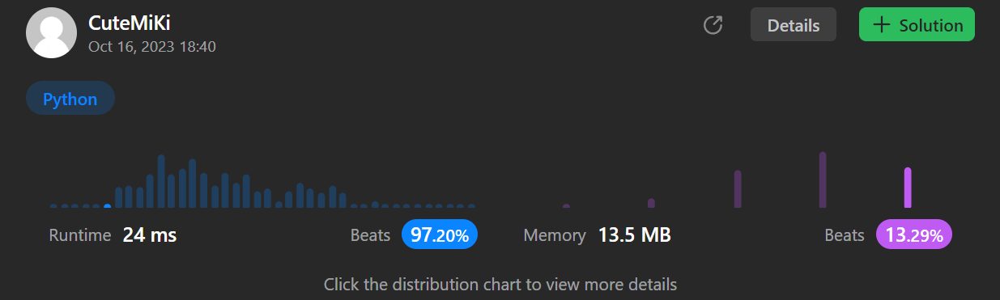

# 1346. Check If N and Its Double Exist
### Tag: [Easy](https://github.com/TheOnlyMiki/LeetCode-For-Fun/tree/main#easy-level), [Array](https://github.com/TheOnlyMiki/LeetCode-For-Fun/tree/main#array), [Hash Table](https://github.com/TheOnlyMiki/LeetCode-For-Fun/tree/main#hash-table), [Two Pointers](https://github.com/TheOnlyMiki/LeetCode-For-Fun/tree/main#two-pointers), [Binary Search](https://github.com/TheOnlyMiki/LeetCode-For-Fun/tree/main#binary-search), [Sorting](https://github.com/TheOnlyMiki/LeetCode-For-Fun/tree/main#sorting)
---
<div class="px-5 pt-4"><div class="flex"></div><div class="xFUwe" data-track-load="description_content"><p>Given an array <code>arr</code> of integers, check if there exist two indices <code>i</code> and <code>j</code> such that :</p>

<ul>
	<li><code>i != j</code></li>
	<li><code>0 &lt;= i, j &lt; arr.length</code></li>
	<li><code>arr[i] == 2 * arr[j]</code></li>
</ul>

<p>&nbsp;</p>
<p><strong class="example">Example 1:</strong></p>

<pre><strong>Input:</strong> arr = [10,2,5,3]
<strong>Output:</strong> true
<strong>Explanation:</strong> For i = 0 and j = 2, arr[i] == 10 == 2 * 5 == 2 * arr[j]
</pre>

<p><strong class="example">Example 2:</strong></p>

<pre><strong>Input:</strong> arr = [3,1,7,11]
<strong>Output:</strong> false
<strong>Explanation:</strong> There is no i and j that satisfy the conditions.
</pre>

<p>&nbsp;</p>
<p><strong>Constraints:</strong></p>

<ul>
	<li><code>2 &lt;= arr.length &lt;= 500</code></li>
	<li><code>-10<sup>3</sup> &lt;= arr[i] &lt;= 10<sup>3</sup></code></li>
</ul>
</div></div>

---


### Solution

```python
class Solution(object):
    def checkIfExist(self, arr):
        """
        :type arr: List[int]
        :rtype: bool
        """
        record = set(arr)
        for n in record:
            if n*2 in record:
                if n*2 == n and arr.count(n) == 1:
                    continue
                return True

        return False
```
