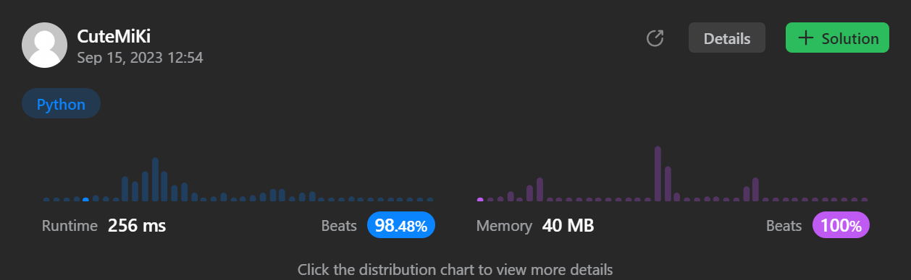

# 1372. Longest ZigZag Path in a Binary Tree
### Tag: [Medium](https://github.com/TheOnlyMiki/LeetCode-For-Fun/tree/main#medium-level), [Dynamic Programming](https://github.com/TheOnlyMiki/LeetCode-For-Fun/tree/main#dynamic-programming), [Depth-First Search](https://github.com/TheOnlyMiki/LeetCode-For-Fun/tree/main#depth-first-search), [Binary Tree](https://github.com/TheOnlyMiki/LeetCode-For-Fun/tree/main#binary-tree)
---
<div class="px-5 pt-4"><div class="flex"></div><div class="xFUwe" data-track-load="description_content"><p>You are given the <code>root</code> of a binary tree.</p>

<p>A ZigZag path for a binary tree is defined as follow:</p>

<ul>
	<li>Choose <strong>any </strong>node in the binary tree and a direction (right or left).</li>
	<li>If the current direction is right, move to the right child of the current node; otherwise, move to the left child.</li>
	<li>Change the direction from right to left or from left to right.</li>
	<li>Repeat the second and third steps until you can't move in the tree.</li>
</ul>

<p>Zigzag length is defined as the number of nodes visited - 1. (A single node has a length of 0).</p>

<p>Return <em>the longest <strong>ZigZag</strong> path contained in that tree</em>.</p>

<p>&nbsp;</p>
<p><strong class="example">Example 1:</strong></p>

<pre><strong>Input:</strong> root = [1,null,1,1,1,null,null,1,1,null,1,null,null,null,1]
<strong>Output:</strong> 3
<strong>Explanation:</strong> Longest ZigZag path in blue nodes (right -&gt; left -&gt; right).
</pre>

<p><strong class="example">Example 2:</strong></p>

<pre><strong>Input:</strong> root = [1,1,1,null,1,null,null,1,1,null,1]
<strong>Output:</strong> 4
<strong>Explanation:</strong> Longest ZigZag path in blue nodes (left -&gt; right -&gt; left -&gt; right).
</pre>

<p><strong class="example">Example 3:</strong></p>

<pre><strong>Input:</strong> root = [1]
<strong>Output:</strong> 0
</pre>

<p>&nbsp;</p>
<p><strong>Constraints:</strong></p>

<ul>
	<li>The number of nodes in the tree is in the range <code>[1, 5 * 10<sup>4</sup>]</code>.</li>
	<li><code>1 &lt;= Node.val &lt;= 100</code></li>
</ul>
</div></div>

---


### Solution

```python
# Definition for a binary tree node.
# class TreeNode(object):
#     def __init__(self, val=0, left=None, right=None):
#         self.val = val
#         self.left = left
#         self.right = right
class Solution(object):
    def longestZigZag(self, root):
        """
        :type root: TreeNode
        :rtype: int
        """
        # Option 3
        output = 0
        record = [(root.left, True, 0), (root.right, False, 0)]

        while record:
            node, direction, count = record.pop()
            if node:
                if direction:
                    record += [(node.left, True, 0), (node.right, False, count+1)]
                else:
                    record += [(node.left, True, count+1), (node.right, False, 0)]
            else:
                if count > output:
                    output = count

        return output

        # Option 2
        """
        self.output = 0
        def dfs(node, direction, count):
            if not node:
                if count > self.output:
                    self.output = count
                return
            
            if direction:
                dfs(node.left, True, 0)
                dfs(node.right, False, count+1)
            else:
                dfs(node.left, True, count+1)
                dfs(node.right, False, 0)

        dfs(root.left, True, 0)
        dfs(root.right, False, 0)

        return self.output
        """
        
        # Option 1
        """
        def dfs(node, direction, count):
            if not node:
                return count
            
            if direction:
                return max(dfs(node.left, True, 0), dfs(node.right, False, count+1))
            else:
                return max(dfs(node.left, True, count+1),dfs(node.right, False, 0))

        return max(dfs(root.left, True, 0),dfs(root.right, False, 0))
        """
```
