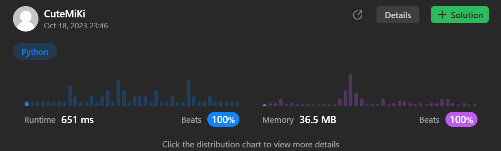

# 1424. Diagonal Traverse II
### Tag: [Medium](https://github.com/TheOnlyMiki/LeetCode-For-Fun/tree/main#medium-level), [Array](https://github.com/TheOnlyMiki/LeetCode-For-Fun/tree/main#array), [Sorting](https://github.com/TheOnlyMiki/LeetCode-For-Fun/tree/main#sorting), [Queue](https://github.com/TheOnlyMiki/LeetCode-For-Fun/tree/main#queue), [Matrix](https://github.com/TheOnlyMiki/LeetCode-For-Fun/tree/main#matrix)
---
<div class="px-5 pt-4"><div class="flex"></div><div class="xFUwe" data-track-load="description_content"><p>Given a 2D integer array <code>nums</code>, return <em>all elements of </em><code>nums</code><em> in diagonal order as shown in the below images</em>.</p>

<p>&nbsp;</p>
<p><strong class="example">Example 1:</strong></p>

<pre><strong>Input:</strong> nums = [[1,2,3],[4,5,6],[7,8,9]]
<strong>Output:</strong> [1,4,2,7,5,3,8,6,9]
</pre>

<p><strong class="example">Example 2:</strong></p>

<pre><strong>Input:</strong> nums = [[1,2,3,4,5],[6,7],[8],[9,10,11],[12,13,14,15,16]]
<strong>Output:</strong> [1,6,2,8,7,3,9,4,12,10,5,13,11,14,15,16]
</pre>

<p>&nbsp;</p>
<p><strong>Constraints:</strong></p>

<ul>
	<li><code>1 &lt;= nums.length &lt;= 10<sup>5</sup></code></li>
	<li><code>1 &lt;= nums[i].length &lt;= 10<sup>5</sup></code></li>
	<li><code>1 &lt;= sum(nums[i].length) &lt;= 10<sup>5</sup></code></li>
	<li><code>1 &lt;= nums[i][j] &lt;= 10<sup>5</sup></code></li>
</ul>
</div></div>

---


### Solution

```python
class Solution(object):
    def findDiagonalOrder(self, nums):
        """
        :type nums: List[List[int]]
        :rtype: List[int]
        """
        # Option 3 - Queue
        last_row = len(nums)-1
        queue = deque([(0, 0)])
        output = []

        while queue:
            i, j = queue.popleft()
            output.append(nums[i][j])
            if j == 0 and i != last_row:
                queue.append((i+1, j))
            if j != len(nums[i])-1:
                queue.append((i, j+1))

        return output

        # Option 2 - Hash Table
        """
        record = {}
        for i in range(len(nums)-1, -1, -1):
            for j in range(len(nums[i])-1, -1, -1):
                if i+j in record:
                    record[i+j].append(nums[i][j])
                else:
                    record[i+j] = [nums[i][j]]
            
            '''
            for j in range(i+len(nums[i])-1, i-1, -1):
                if j in record:
                    record[j].append(nums[i][j-i])
                else:
                    record[j] = [nums[i][j-i]]
            '''

            '''
            for j in range(i+len(nums[i])-1, i-1, -1):
                record[j] = record[j] + [nums[i][j-i]] if j in record else [nums[i][j-i]]
            '''
        
        '''
        output = []
        for i in range(len(record)):
            output += record.pop(i)

        return output
        '''
        return [j for i in record for j in record[i]]
        """

        # Option 1 - BF, slow, cannot pass
        """
        row, loop, limit = len(nums), len(nums) + len(nums[0]), 1e5

        def read(i, j):
            while j < limit:
                if j < len(nums[i]):
                    output.append(nums[i][j])
                if i == 0:
                    return
                i, j = i-1, j+1

        i, output = 0, []
        while i < loop:
            if i < row:
                if row + len(nums[i]) > loop:
                    loop = row + len(nums[i]) 
                read(i, 0)
            else:
                read(row-1, i-row+1)
            i += 1

        return output
        """
```
