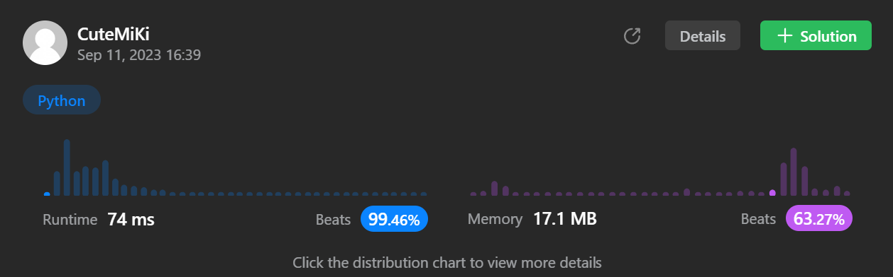

# 1456. Maximum Number of Vowels in a Substring of Given Length
### Tag: [Medium](https://github.com/TheOnlyMiki/LeetCode-For-Fun/tree/main#medium-level), [String](https://github.com/TheOnlyMiki/LeetCode-For-Fun/tree/main#string), [Sliding Window](https://github.com/TheOnlyMiki/LeetCode-For-Fun/tree/main#sliding-window)
---
<div class="px-5 pt-4"><div class="flex"></div><div class="xFUwe" data-track-load="description_content"><p>Given a string <code>s</code> and an integer <code>k</code>, return <em>the maximum number of vowel letters in any substring of </em><code>s</code><em> with length </em><code>k</code>.</p>

<p><strong>Vowel letters</strong> in English are <code>'a'</code>, <code>'e'</code>, <code>'i'</code>, <code>'o'</code>, and <code>'u'</code>.</p>

<p>&nbsp;</p>
<p><strong class="example">Example 1:</strong></p>

<pre><strong>Input:</strong> s = "abciiidef", k = 3
<strong>Output:</strong> 3
<strong>Explanation:</strong> The substring "iii" contains 3 vowel letters.
</pre>

<p><strong class="example">Example 2:</strong></p>

<pre><strong>Input:</strong> s = "aeiou", k = 2
<strong>Output:</strong> 2
<strong>Explanation:</strong> Any substring of length 2 contains 2 vowels.
</pre>

<p><strong class="example">Example 3:</strong></p>

<pre><strong>Input:</strong> s = "leetcode", k = 3
<strong>Output:</strong> 2
<strong>Explanation:</strong> "lee", "eet" and "ode" contain 2 vowels.
</pre>

<p>&nbsp;</p>
<p><strong>Constraints:</strong></p>

<ul>
	<li><code>1 &lt;= s.length &lt;= 10<sup>5</sup></code></li>
	<li><code>s</code> consists of lowercase English letters.</li>
	<li><code>1 &lt;= k &lt;= s.length</code></li>
</ul>
</div></div>

---


### Solution

```python
class Solution(object):
    def maxVowels(self, s, k):
        """
        :type s: str
        :type k: int
        :rtype: int
        """
        vowels = {'a','e','i','o','u'}
        count = sum( 1 if s[i] in vowels else 0 for i in range(k) )
        maximum = count

        for i in range(k, len(s)):
            if s[i-k] in vowels:
                count -= 1
            if s[i] in vowels:
                count += 1

            if count > maximum:
                maximum = count

        return maximum
```
