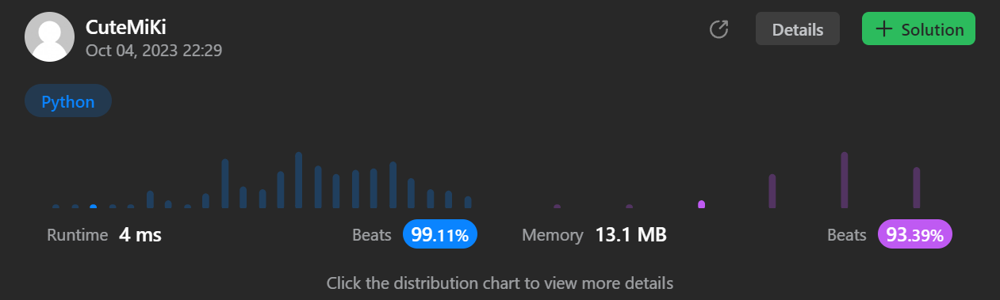

# 1492. The kth Factor of n
### Tag: [Medium](https://github.com/TheOnlyMiki/LeetCode-For-Fun/tree/main#medium-level), [Math](https://github.com/TheOnlyMiki/LeetCode-For-Fun/tree/main#math)
---
<div class="px-5 pt-4"><div class="flex"></div><div class="xFUwe" data-track-load="description_content"><p>You are given two positive integers <code>n</code> and <code>k</code>. A factor of an integer <code>n</code> is defined as an integer <code>i</code> where <code>n % i == 0</code>.</p>

<p>Consider a list of all factors of <code>n</code> sorted in <strong>ascending order</strong>, return <em>the </em><code>k<sup>th</sup></code><em> factor</em> in this list or return <code>-1</code> if <code>n</code> has less than <code>k</code> factors.</p>

<p>&nbsp;</p>
<p><strong class="example">Example 1:</strong></p>

<pre><strong>Input:</strong> n = 12, k = 3
<strong>Output:</strong> 3
<strong>Explanation:</strong> Factors list is [1, 2, 3, 4, 6, 12], the 3<sup>rd</sup> factor is 3.
</pre>

<p><strong class="example">Example 2:</strong></p>

<pre><strong>Input:</strong> n = 7, k = 2
<strong>Output:</strong> 7
<strong>Explanation:</strong> Factors list is [1, 7], the 2<sup>nd</sup> factor is 7.
</pre>

<p><strong class="example">Example 3:</strong></p>

<pre><strong>Input:</strong> n = 4, k = 4
<strong>Output:</strong> -1
<strong>Explanation:</strong> Factors list is [1, 2, 4], there is only 3 factors. We should return -1.
</pre>

<p>&nbsp;</p>
<p><strong>Constraints:</strong></p>

<ul>
	<li><code>1 &lt;= k &lt;= n &lt;= 1000</code></li>
</ul>

<p>&nbsp;</p>
<p><strong>Follow up:</strong></p>

<p>Could you solve this problem in less than O(n) complexity?</p>
</div></div>

---


### Solution

```python
class Solution(object):
    def kthFactor(self, n, k):
        """
        :type n: int
        :type k: int
        :rtype: int
        """
        # Option 3 - Time O(n^0.5), Space O(1)
        sqrt_n = int(sqrt(n))
        for i in range(1, sqrt_n+1):
            if n % i == 0:
                if k == 1:
                    return i
                k -= 1

        if sqrt_n * sqrt_n == n:
            sqrt_n -= 1

        for i in range(sqrt_n, 0, -1):
            if n % i == 0:
                if k == 1:
                    return n / i
                k -= 1

        return -1

        # Option 2 - Time O(n^0.5), Space O(n^0.5)
        """
        sqrt_n = int(sqrt(n))
        record = []
        for i in range(1, sqrt_n + 1):
            if n % i == 0:
                if k == 1:
                    return i
                record.append(i)
                k -= 1

        if sqrt_n == n // record[-1]:
            record.pop()

        return -1 if len(record)-k < 0 else n // record[len(record)-k]
        """

        # Option 1 - Time O(n)
        """
        for i in range(1, n//2+1):
            if n % i == 0:
                if k == 1:
                    return i
                k -= 1

        return n if k == 1 else -1
        """
```
