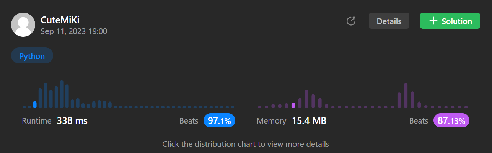

# 1493. Longest Subarray of 1's After Deleting One Element
### Tag: [Medium](https://github.com/TheOnlyMiki/LeetCode-For-Fun/tree/main#medium-level), [String](https://github.com/TheOnlyMiki/LeetCode-For-Fun/tree/main#string), [Sliding Window](https://github.com/TheOnlyMiki/LeetCode-For-Fun/tree/main#sliding-window)
---
<div class="px-5 pt-4"><div class="flex"></div><div class="xFUwe" data-track-load="description_content"><p>Given a binary array <code>nums</code>, you should delete one element from it.</p>

<p>Return <em>the size of the longest non-empty subarray containing only </em><code>1</code><em>'s in the resulting array</em>. Return <code>0</code> if there is no such subarray.</p>

<p>&nbsp;</p>
<p><strong class="example">Example 1:</strong></p>

<pre><strong>Input:</strong> nums = [1,1,0,1]
<strong>Output:</strong> 3
<strong>Explanation:</strong> After deleting the number in position 2, [1,1,1] contains 3 numbers with value of 1's.
</pre>

<p><strong class="example">Example 2:</strong></p>

<pre><strong>Input:</strong> nums = [0,1,1,1,0,1,1,0,1]
<strong>Output:</strong> 5
<strong>Explanation:</strong> After deleting the number in position 4, [0,1,1,1,1,1,0,1] longest subarray with value of 1's is [1,1,1,1,1].
</pre>

<p><strong class="example">Example 3:</strong></p>

<pre><strong>Input:</strong> nums = [1,1,1]
<strong>Output:</strong> 2
<strong>Explanation:</strong> You must delete one element.
</pre>

<p>&nbsp;</p>
<p><strong>Constraints:</strong></p>

<ul>
	<li><code>1 &lt;= nums.length &lt;= 10<sup>5</sup></code></li>
	<li><code>nums[i]</code> is either <code>0</code> or <code>1</code>.</li>
</ul>
</div></div>

---


### Solution

```python
class Solution(object):
    def longestSubarray(self, nums):
        """
        :type nums: List[int]
        :rtype: int
        """
        index, k = 0, 1
        for i, num in enumerate(nums):
            if num == 0:
                k -= 1

            if k < 0:
                if nums[index] == 0:
                    k += 1
                index += 1

        return len(nums) - index - 1
```
