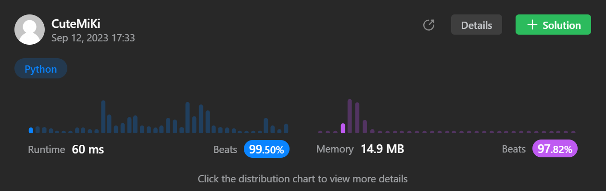

# 1657. Determine if Two Strings Are Close
### Tag: [Medium](https://github.com/TheOnlyMiki/LeetCode-For-Fun/tree/main#medium-level), [Hash Table](https://github.com/TheOnlyMiki/LeetCode-For-Fun/tree/main#hash-table), [String](https://github.com/TheOnlyMiki/LeetCode-For-Fun/tree/main#string), [Sorting](https://github.com/TheOnlyMiki/LeetCode-For-Fun/tree/main#sorting)
---
<div class="px-5 pt-4"><div class="flex"></div><div class="xFUwe" data-track-load="description_content"><p>Two strings are considered <strong>close</strong> if you can attain one from the other using the following operations:</p>

<ul>
	<li>Operation 1: Swap any two <strong>existing</strong> characters.
	<ul>
		<li>For example, <code>a<u>b</u>cd<u>e</u> -&gt; a<u>e</u>cd<u>b</u></code></li>
	</ul>
	</li>
	<li>Operation 2: Transform <strong>every</strong> occurrence of one <strong>existing</strong> character into another <strong>existing</strong> character, and do the same with the other character.
	<ul>
		<li>For example, <code><u>aa</u>c<u>abb</u> -&gt; <u>bb</u>c<u>baa</u></code> (all <code>a</code>'s turn into <code>b</code>'s, and all <code>b</code>'s turn into <code>a</code>'s)</li>
	</ul>
	</li>
</ul>

<p>You can use the operations on either string as many times as necessary.</p>

<p>Given two strings, <code>word1</code> and <code>word2</code>, return <code>true</code><em> if </em><code>word1</code><em> and </em><code>word2</code><em> are <strong>close</strong>, and </em><code>false</code><em> otherwise.</em></p>

<p>&nbsp;</p>
<p><strong class="example">Example 1:</strong></p>

<pre><strong>Input:</strong> word1 = "abc", word2 = "bca"
<strong>Output:</strong> true
<strong>Explanation:</strong> You can attain word2 from word1 in 2 operations.
Apply Operation 1: "a<u>bc</u>" -&gt; "a<u>cb</u>"
Apply Operation 1: "<u>a</u>c<u>b</u>" -&gt; "<u>b</u>c<u>a</u>"
</pre>

<p><strong class="example">Example 2:</strong></p>

<pre><strong>Input:</strong> word1 = "a", word2 = "aa"
<strong>Output:</strong> false
<strong>Explanation: </strong>It is impossible to attain word2 from word1, or vice versa, in any number of operations.
</pre>

<p><strong class="example">Example 3:</strong></p>

<pre><strong>Input:</strong> word1 = "cabbba", word2 = "abbccc"
<strong>Output:</strong> true
<strong>Explanation:</strong> You can attain word2 from word1 in 3 operations.
Apply Operation 1: "ca<u>b</u>bb<u>a</u>" -&gt; "ca<u>a</u>bb<u>b</u>"
<code>Apply Operation 2: "</code><u>c</u>aa<u>bbb</u>" -&gt; "<u>b</u>aa<u>ccc</u>"
Apply Operation 2: "<u>baa</u>ccc" -&gt; "<u>abb</u>ccc"
</pre>

<p>&nbsp;</p>
<p><strong>Constraints:</strong></p>

<ul>
	<li><code>1 &lt;= word1.length, word2.length &lt;= 10<sup>5</sup></code></li>
	<li><code>word1</code> and <code>word2</code> contain only lowercase English letters.</li>
</ul>
</div></div>

---


### Solution

```python
class Solution(object):
    def closeStrings(self, word1, word2):
        """
        :type word1: str
        :type word2: str
        :rtype: bool
        """
        # Option 2
        record1, record2 = sorted(set(word1)), sorted(set(word2))
        if record1 != record2:
            return False

        count1, count2 = [], []
        for i in range(len(record1)):
            count1.append(word1.count(record1[i]))
            count2.append(word2.count(record2[i]))

        return sorted(count1) == sorted(count2)

        # Option 1
        """
        if len(word1) != len(word2):
            return False

        count1, count2 = {}, {}
        for i in range(len(word1)):
            if word1[i] in count1:
                count1[word1[i]] += 1
            else:
                count1[word1[i]] = 1

            if word2[i] in count2:
                count2[word2[i]] += 1
            else:
                count2[word2[i]] = 1

        if len(count1) != len(count2) or sum(ord(x) for x in count1.keys()) != sum(ord(x) for x in count2.keys()):
            return False

        return sorted(count1.values()) == sorted(count2.values())
        """
```
