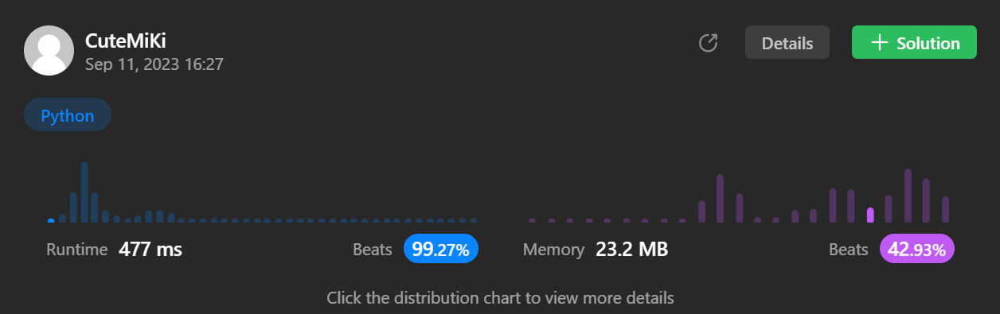

# 1679. Max Number of K-Sum Pairs
### Tag: [Medium](https://github.com/TheOnlyMiki/LeetCode-For-Fun/tree/main#medium-level), [Array](https://github.com/TheOnlyMiki/LeetCode-For-Fun/tree/main#array), [Hash Table](https://github.com/TheOnlyMiki/LeetCode-For-Fun/tree/main#hash-table), [Two Pointers](https://github.com/TheOnlyMiki/LeetCode-For-Fun/tree/main#two-pointers), [Sorting](https://github.com/TheOnlyMiki/LeetCode-For-Fun/tree/main#sorting)
---
<div class="px-5 pt-4"><div class="flex"></div><div class="xFUwe" data-track-load="description_content"><p>You are given an integer array <code>nums</code> and an integer <code>k</code>.</p>

<p>In one operation, you can pick two numbers from the array whose sum equals <code>k</code> and remove them from the array.</p>

<p>Return <em>the maximum number of operations you can perform on the array</em>.</p>

<p>&nbsp;</p>
<p><strong class="example">Example 1:</strong></p>

<pre><strong>Input:</strong> nums = [1,2,3,4], k = 5
<strong>Output:</strong> 2
<strong>Explanation:</strong> Starting with nums = [1,2,3,4]:
- Remove numbers 1 and 4, then nums = [2,3]
- Remove numbers 2 and 3, then nums = []
There are no more pairs that sum up to 5, hence a total of 2 operations.</pre>

<p><strong class="example">Example 2:</strong></p>

<pre><strong>Input:</strong> nums = [3,1,3,4,3], k = 6
<strong>Output:</strong> 1
<strong>Explanation:</strong> Starting with nums = [3,1,3,4,3]:
- Remove the first two 3's, then nums = [1,4,3]
There are no more pairs that sum up to 6, hence a total of 1 operation.</pre>

<p>&nbsp;</p>
<p><strong>Constraints:</strong></p>

<ul>
	<li><code>1 &lt;= nums.length &lt;= 10<sup>5</sup></code></li>
	<li><code>1 &lt;= nums[i] &lt;= 10<sup>9</sup></code></li>
	<li><code>1 &lt;= k &lt;= 10<sup>9</sup></code></li>
</ul>
</div></div>

---


### Solution

```python
class Solution(object):
    def maxOperations(self, nums, k):
        """
        :type nums: List[int]
        :type k: int
        :rtype: int
        """
        output = 0
        record = {}
        temp = None
        for num in nums:
            temp = k - num
            if temp in record and record[temp] > 0:
                output += 1
                record[temp] -= 1
            else:
                if num in record:
                    record[num] += 1
                else:
                    record[num] = 1

        return output
```
