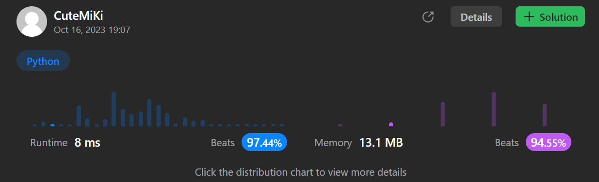

# 1752. Check if Array Is Sorted and Rotated
### Tag: [Easy](https://github.com/TheOnlyMiki/LeetCode-For-Fun/tree/main#easy-level), [Array](https://github.com/TheOnlyMiki/LeetCode-For-Fun/tree/main#array)
---
<div class="px-5 pt-4"><div class="flex"></div><div class="xFUwe" data-track-load="description_content"><p>Given an array <code>nums</code>, return <code>true</code><em> if the array was originally sorted in non-decreasing order, then rotated <strong>some</strong> number of positions (including zero)</em>. Otherwise, return <code>false</code>.</p>

<p>There may be <strong>duplicates</strong> in the original array.</p>

<p><strong>Note:</strong> An array <code>A</code> rotated by <code>x</code> positions results in an array <code>B</code> of the same length such that <code>A[i] == B[(i+x) % A.length]</code>, where <code>%</code> is the modulo operation.</p>

<p>&nbsp;</p>
<p><strong class="example">Example 1:</strong></p>

<pre><strong>Input:</strong> nums = [3,4,5,1,2]
<strong>Output:</strong> true
<strong>Explanation:</strong> [1,2,3,4,5] is the original sorted array.
You can rotate the array by x = 3 positions to begin on the the element of value 3: [3,4,5,1,2].
</pre>

<p><strong class="example">Example 2:</strong></p>

<pre><strong>Input:</strong> nums = [2,1,3,4]
<strong>Output:</strong> false
<strong>Explanation:</strong> There is no sorted array once rotated that can make nums.
</pre>

<p><strong class="example">Example 3:</strong></p>

<pre><strong>Input:</strong> nums = [1,2,3]
<strong>Output:</strong> true
<strong>Explanation:</strong> [1,2,3] is the original sorted array.
You can rotate the array by x = 0 positions (i.e. no rotation) to make nums.
</pre>

<p>&nbsp;</p>
<p><strong>Constraints:</strong></p>

<ul>
	<li><code>1 &lt;= nums.length &lt;= 100</code></li>
	<li><code>1 &lt;= nums[i] &lt;= 100</code></li>
</ul>
</div></div>

---


### Solution

```python
class Solution(object):
    def check(self, nums):
        """
        :type nums: List[int]
        :rtype: bool
        """
        increase = True
        for i in range(1, len(nums)):
            if nums[i] < nums[i-1]:
                if increase and nums[0] >= nums[i]:
                    increase = False
                else:
                    return False

        return increase or nums[-1] <= nums[0]
```
