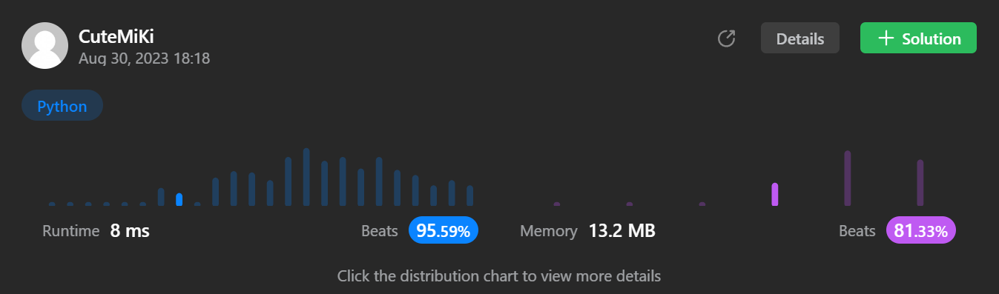

# 1768. Merge Strings Alternately
### Tag: [Easy](https://github.com/TheOnlyMiki/LeetCode-For-Fun/tree/main#easy-level), [Two Pointers](https://github.com/TheOnlyMiki/LeetCode-For-Fun/tree/main#two-pointers), [String](https://github.com/TheOnlyMiki/LeetCode-For-Fun/tree/main#string)
---
<div class="px-5 pt-4"><div class="flex"></div><div class="xFUwe" data-track-load="description_content"><p>You are given two strings <code>word1</code> and <code>word2</code>. Merge the strings by adding letters in alternating order, starting with <code>word1</code>. If a string is longer than the other, append the additional letters onto the end of the merged string.</p>

<p>Return <em>the merged string.</em></p>

<p>&nbsp;</p>
<p><strong class="example">Example 1:</strong></p>

<pre><strong>Input:</strong> word1 = "abc", word2 = "pqr"
<strong>Output:</strong> "apbqcr"
<strong>Explanation:</strong>&nbsp;The merged string will be merged as so:
word1:  a   b   c
word2:    p   q   r
merged: a p b q c r
</pre>

<p><strong class="example">Example 2:</strong></p>

<pre><strong>Input:</strong> word1 = "ab", word2 = "pqrs"
<strong>Output:</strong> "apbqrs"
<strong>Explanation:</strong>&nbsp;Notice that as word2 is longer, "rs" is appended to the end.
word1:  a   b 
word2:    p   q   r   s
merged: a p b q   r   s
</pre>

<p><strong class="example">Example 3:</strong></p>

<pre><strong>Input:</strong> word1 = "abcd", word2 = "pq"
<strong>Output:</strong> "apbqcd"
<strong>Explanation:</strong>&nbsp;Notice that as word1 is longer, "cd" is appended to the end.
word1:  a   b   c   d
word2:    p   q 
merged: a p b q c   d
</pre>

<p>&nbsp;</p>
<p><strong>Constraints:</strong></p>

<ul>
	<li><code>1 &lt;= word1.length, word2.length &lt;= 100</code></li>
	<li><code>word1</code> and <code>word2</code> consist of lowercase English letters.</li>
</ul></div></div>

---


### Solution

```python
class Solution(object):
    def mergeAlternately(self, word1, word2):
        """
        :type word1: str
        :type word2: str
        :rtype: str
        """
        min_len = min(len(word1), len(word2))
        output = ""
        i = 0
        even = True

        while i < min_len:
            if even:
                output += word1[i]
            else:
                output += word2[i]
                i += 1
            
            even = not even

        output += word1[i:]
        output += word2[i:]

        return output
```
