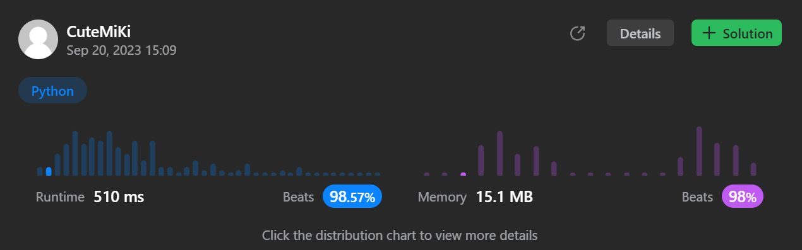

# 1926. Nearest Exit from Entrance in Maze
### Tag: [Medium](https://github.com/TheOnlyMiki/LeetCode-For-Fun/tree/main#medium-level), [Array](https://github.com/TheOnlyMiki/LeetCode-For-Fun/tree/main#array), [Breadth-First Search](https://github.com/TheOnlyMiki/LeetCode-For-Fun/tree/main#breadth-first-search), [Matrix](https://github.com/TheOnlyMiki/LeetCode-For-Fun/tree/main#matrix)
---
<div class="px-5 pt-4"><div class="flex"></div><div class="xFUwe" data-track-load="description_content"><p>You are given an <code>m x n</code> matrix <code>maze</code> (<strong>0-indexed</strong>) with empty cells (represented as <code>'.'</code>) and walls (represented as <code>'+'</code>). You are also given the <code>entrance</code> of the maze, where <code>entrance = [entrance<sub>row</sub>, entrance<sub>col</sub>]</code> denotes the row and column of the cell you are initially standing at.</p>

<p>In one step, you can move one cell <strong>up</strong>, <strong>down</strong>, <strong>left</strong>, or <strong>right</strong>. You cannot step into a cell with a wall, and you cannot step outside the maze. Your goal is to find the <strong>nearest exit</strong> from the <code>entrance</code>. An <strong>exit</strong> is defined as an <strong>empty cell</strong> that is at the <strong>border</strong> of the <code>maze</code>. The <code>entrance</code> <strong>does not count</strong> as an exit.</p>

<p>Return <em>the <strong>number of steps</strong> in the shortest path from the </em><code>entrance</code><em> to the nearest exit, or </em><code>-1</code><em> if no such path exists</em>.</p>

<p>&nbsp;</p>
<p><strong class="example">Example 1:</strong></p>

<pre><strong>Input:</strong> maze = [["+","+",".","+"],[".",".",".","+"],["+","+","+","."]], entrance = [1,2]
<strong>Output:</strong> 1
<strong>Explanation:</strong> There are 3 exits in this maze at [1,0], [0,2], and [2,3].
Initially, you are at the entrance cell [1,2].
- You can reach [1,0] by moving 2 steps left.
- You can reach [0,2] by moving 1 step up.
It is impossible to reach [2,3] from the entrance.
Thus, the nearest exit is [0,2], which is 1 step away.
</pre>

<p><strong class="example">Example 2:</strong></p>

<pre><strong>Input:</strong> maze = [["+","+","+"],[".",".","."],["+","+","+"]], entrance = [1,0]
<strong>Output:</strong> 2
<strong>Explanation:</strong> There is 1 exit in this maze at [1,2].
[1,0] does not count as an exit since it is the entrance cell.
Initially, you are at the entrance cell [1,0].
- You can reach [1,2] by moving 2 steps right.
Thus, the nearest exit is [1,2], which is 2 steps away.
</pre>

<p><strong class="example">Example 3:</strong></p>

<pre><strong>Input:</strong> maze = [[".","+"]], entrance = [0,0]
<strong>Output:</strong> -1
<strong>Explanation:</strong> There are no exits in this maze.
</pre>

<p>&nbsp;</p>
<p><strong>Constraints:</strong></p>

<ul>
	<li><code>maze.length == m</code></li>
	<li><code>maze[i].length == n</code></li>
	<li><code>1 &lt;= m, n &lt;= 100</code></li>
	<li><code>maze[i][j]</code> is either <code>'.'</code> or <code>'+'</code>.</li>
	<li><code>entrance.length == 2</code></li>
	<li><code>0 &lt;= entrance<sub>row</sub> &lt; m</code></li>
	<li><code>0 &lt;= entrance<sub>col</sub> &lt; n</code></li>
	<li><code>entrance</code> will always be an empty cell.</li>
</ul>
</div></div>

---


### Solution

```python
class Solution(object):
    def nearestExit(self, maze, entrance):
        """
        :type maze: List[List[str]]
        :type entrance: List[int]
        :rtype: int
        """
        row, col = len(maze), len(maze[0])
        moves = [(0,1), (1,0), (0,-1), (-1,0)]
        maze[entrance[0]][entrance[1]] = None

        record = []
        for x, y in moves:
            x, y = entrance[0] + x, entrance[1] + y
            if -1 < x < row and -1 < y < col and maze[x][y] == '.':
                maze[x][y] = None
                record.append((x, y))
        
        step = 1
        while record:
            temp = []
            for x, y in record:
                for new_x, new_y in moves:
                    new_x, new_y = x + new_x, y + new_y
                    if new_x == -1 or new_x == row or new_y == -1 or new_y == col:
                        return step
                    if maze[new_x][new_y] == '.':
                        maze[new_x][new_y] = None
                        temp.append((new_x, new_y))

            step += 1
            record = temp

        return -1
```
