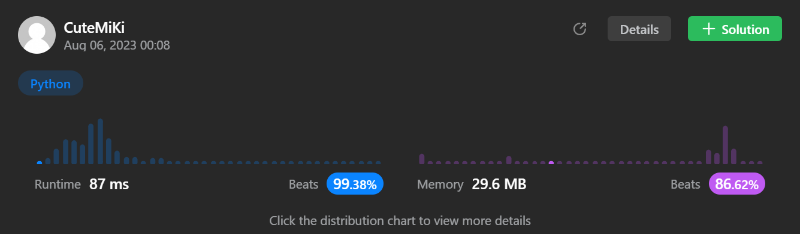

# 208. Implement Trie (Prefix Tree)
### Tag: [Medium](https://github.com/TheOnlyMiki/LeetCode-For-Fun/tree/main#medium-level), [Hash Table](https://github.com/TheOnlyMiki/LeetCode-For-Fun/tree/main#hash-table), [String](https://github.com/TheOnlyMiki/LeetCode-For-Fun/tree/main#string), [Design](https://github.com/TheOnlyMiki/LeetCode-For-Fun/tree/main#design), [Trie](https://github.com/TheOnlyMiki/LeetCode-For-Fun/tree/main#trie)
---
<div class="px-5 pt-4"><div class="flex"></div><div class="xFUwe" data-track-load="description_content"><p>A <a href="https://en.wikipedia.org/wiki/Trie" target="_blank"><strong>trie</strong></a> (pronounced as "try") or <strong>prefix tree</strong> is a tree data structure used to efficiently store and retrieve keys in a dataset of strings. There are various applications of this data structure, such as autocomplete and spellchecker.</p>

<p>Implement the Trie class:</p>

<ul>
	<li><code>Trie()</code> Initializes the trie object.</li>
	<li><code>void insert(String word)</code> Inserts the string <code>word</code> into the trie.</li>
	<li><code>boolean search(String word)</code> Returns <code>true</code> if the string <code>word</code> is in the trie (i.e., was inserted before), and <code>false</code> otherwise.</li>
	<li><code>boolean startsWith(String prefix)</code> Returns <code>true</code> if there is a previously inserted string <code>word</code> that has the prefix <code>prefix</code>, and <code>false</code> otherwise.</li>
</ul>

<p>&nbsp;</p>
<p><strong class="example">Example 1:</strong></p>

<pre><strong>Input</strong>
["Trie", "insert", "search", "search", "startsWith", "insert", "search"]
[[], ["apple"], ["apple"], ["app"], ["app"], ["app"], ["app"]]
<strong>Output</strong>
[null, null, true, false, true, null, true]

<strong>Explanation</strong>
Trie trie = new Trie();
trie.insert("apple");
trie.search("apple");   // return True
trie.search("app");     // return False
trie.startsWith("app"); // return True
trie.insert("app");
trie.search("app");     // return True
</pre>

<p>&nbsp;</p>
<p><strong>Constraints:</strong></p>

<ul>
	<li><code>1 &lt;= word.length, prefix.length &lt;= 2000</code></li>
	<li><code>word</code> and <code>prefix</code> consist only of lowercase English letters.</li>
	<li>At most <code>3 * 10<sup>4</sup></code> calls <strong>in total</strong> will be made to <code>insert</code>, <code>search</code>, and <code>startsWith</code>.</li>
</ul>
</div></div>

---


### Solution

```python
class Trie(object):
    def __init__(self):
        self.elements = {}

    def insert(self, word):
        """
        :type word: str
        :rtype: None
        """
        temp = self.elements
        for c in word:
            if c in temp:
                temp = temp[c]
            else:
                temp[c] = {}
                temp = temp[c]

        temp[True] = None

    def search(self, word):
        """
        :type word: str
        :rtype: bool
        """
        temp = self.elements
        for c in word:
            if c in temp:
                temp = temp[c]
            else:
                return False

        return True in temp

    def startsWith(self, prefix):
        """
        :type prefix: str
        :rtype: bool
        """
        temp = self.elements
        for c in prefix:
            if c in temp:
                temp = temp[c]
            else:
                return False

        return True
# Option 1 - too complicated
'''
class MyNode(object):
        def __init__(self, val='', next={}):
            self.val = val
            self.next = next

class Trie(object):
    def __init__(self):
        self.elements = {}
        self.items = set()

    def insert(self, word):
        """
        :type word: str
        :rtype: None
        """
        if word not in self.items:
            self.items.add(word)

        temp = None
        if word[0] in self.elements:
            node = self.elements[word[0]]
            for i in xrange(1, len(word)):
                if word[i] in node.next:
                    node = node.next[word[i]]
                else:
                    temp = MyNode(word[i], {})
                    node.next[word[i]] = temp
                    node = temp
        else:
            node = MyNode(word[0], {})
            self.elements[word[0]] = node
            for i in xrange(1, len(word)):
                temp = MyNode(word[i], {})
                node.next[word[i]] = temp
                node = temp

    def search(self, word):
        """
        :type word: str
        :rtype: bool
        """
        if word in self.items:
            return True
        return False

    def startsWith(self, prefix):
        """
        :type prefix: str
        :rtype: bool
        """
        if prefix:
            if prefix[0] not in self.elements:
                return False

            node = self.elements[prefix[0]]
            for i in range(1, len(prefix)):
                if prefix[i] not in node.next:
                    return False
                node = node.next[prefix[i]]

            return True

        return False

# Your Trie object will be instantiated and called as such:
# obj = Trie()
# obj.insert(word)
# param_2 = obj.search(word)
# param_3 = obj.startsWith(prefix)
'''
```
