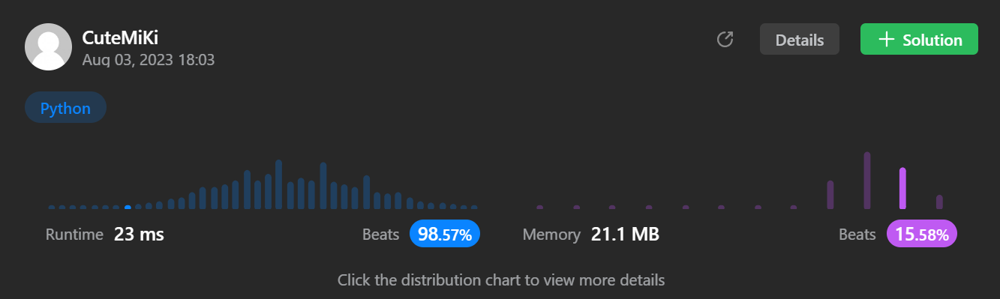

# 230. Kth Smallest Element in a BST
### Tag: [Medium](https://github.com/TheOnlyMiki/LeetCode-For-Fun/tree/main#medium-level), [Depth-First Search](https://github.com/TheOnlyMiki/LeetCode-For-Fun/tree/main#depth-first-search), [Binary Tree](https://github.com/TheOnlyMiki/LeetCode-For-Fun/tree/main#binary-tree)
---
<div class="px-5 pt-4"><div class="flex"></div><div class="xFUwe" data-track-load="description_content"><p>Given the <code>root</code> of a binary search tree, and an integer <code>k</code>, return <em>the</em> <code>k<sup>th</sup></code> <em>smallest value (<strong>1-indexed</strong>) of all the values of the nodes in the tree</em>.</p>

<p>&nbsp;</p>
<p><strong class="example">Example 1:</strong></p>

<pre><strong>Input:</strong> root = [3,1,4,null,2], k = 1
<strong>Output:</strong> 1
</pre>

<p><strong class="example">Example 2:</strong></p>

<pre><strong>Input:</strong> root = [5,3,6,2,4,null,null,1], k = 3
<strong>Output:</strong> 3
</pre>

<p>&nbsp;</p>
<p><strong>Constraints:</strong></p>

<ul>
	<li>The number of nodes in the tree is <code>n</code>.</li>
	<li><code>1 &lt;= k &lt;= n &lt;= 10<sup>4</sup></code></li>
	<li><code>0 &lt;= Node.val &lt;= 10<sup>4</sup></code></li>
</ul>

<p>&nbsp;</p>
<p><strong>Follow up:</strong> If the BST is modified often (i.e., we can do insert and delete operations) and you need to find the kth smallest frequently, how would you optimize?</p>
</div></div>

---


### Solution

```python
# Definition for a binary tree node.
# class TreeNode(object):
#     def __init__(self, val=0, left=None, right=None):
#         self.val = val
#         self.left = left
#         self.right = right
class Solution(object):
    def kthSmallest(self, root, k):
        """
        :type root: TreeNode
        :type k: int
        :rtype: int
        """
        # Option 2 - Use stack, BST means left node always smaller than the parent, and right node is larger than itself's parent, but not larger than other parents of itself's parent
        self.stack = []

        def pushStack(root):
            while root:
                self.stack.append(root)
                root = root.left
        
        pushStack(root)

        temp = None
        for i in range(k):
            temp = self.stack[-1]
            self.stack.pop()
            pushStack(temp.right)

        return temp.val

        # Option 1 - BFS then sorted the whole value of nodes, then find the k index in list
        """
        values = [root.val]
        nodes = [root]
        next_level = None

        while nodes:
            next_level = []
            for node in nodes:
                if node.left:
                    next_level.append(node.left)
                    values.append(node.left.val)
                if node.right:
                    next_level.append(node.right)
                    values.append(node.right.val)
            nodes = next_level

        return sorted(values)[k-1]
        """
```
