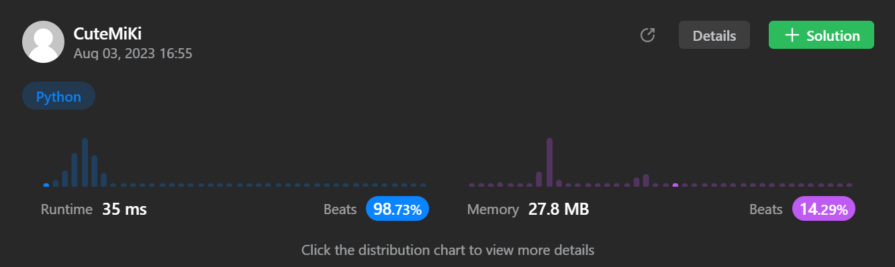

# 236. Lowest Common Ancestor of a Binary Tree
### Tag: [Medium](https://github.com/TheOnlyMiki/LeetCode-For-Fun/tree/main#medium-level), [Breadth-First Search](https://github.com/TheOnlyMiki/LeetCode-For-Fun/tree/main#breadth-first-search), [Depth-First Search](https://github.com/TheOnlyMiki/LeetCode-For-Fun/tree/main#depth-first-search), [Binary Tree](https://github.com/TheOnlyMiki/LeetCode-For-Fun/tree/main#binary-tree)
---
<div class="px-5 pt-4"><div class="flex"></div><div class="_1l1MA" data-track-load="description_content"><p>Given a binary tree, find the lowest common ancestor (LCA) of two given nodes in the tree.</p>

<p>According to the <a href="https://en.wikipedia.org/wiki/Lowest_common_ancestor" target="_blank">definition of LCA on Wikipedia</a>: “The lowest common ancestor is defined between two nodes <code>p</code> and <code>q</code> as the lowest node in <code>T</code> that has both <code>p</code> and <code>q</code> as descendants (where we allow <b>a node to be a descendant of itself</b>).”</p>

<p>&nbsp;</p>
<p><strong class="example">Example 1:</strong></p>

<pre><strong>Input:</strong> root = [3,5,1,6,2,0,8,null,null,7,4], p = 5, q = 1
<strong>Output:</strong> 3
<strong>Explanation:</strong> The LCA of nodes 5 and 1 is 3.
</pre>

<p><strong class="example">Example 2:</strong></p>

<pre><strong>Input:</strong> root = [3,5,1,6,2,0,8,null,null,7,4], p = 5, q = 4
<strong>Output:</strong> 5
<strong>Explanation:</strong> The LCA of nodes 5 and 4 is 5, since a node can be a descendant of itself according to the LCA definition.
</pre>

<p><strong class="example">Example 3:</strong></p>

<pre><strong>Input:</strong> root = [1,2], p = 1, q = 2
<strong>Output:</strong> 1
</pre>

<p>&nbsp;</p>
<p><strong>Constraints:</strong></p>

<ul>
	<li>The number of nodes in the tree is in the range <code>[2, 10<sup>5</sup>]</code>.</li>
	<li><code>-10<sup>9</sup> &lt;= Node.val &lt;= 10<sup>9</sup></code></li>
	<li>All <code>Node.val</code> are <strong>unique</strong>.</li>
	<li><code>p != q</code></li>
	<li><code>p</code> and <code>q</code> will exist in the tree.</li>
</ul>
</div></div>

---


### Solution

```python
# Definition for a binary tree node.
# class TreeNode(object):
#     def __init__(self, x):
#         self.val = x
#         self.left = None
#         self.right = None

class Solution(object):
    def lowestCommonAncestor(self, root, p, q):
        """
        :type root: TreeNode
        :type p: TreeNode
        :type q: TreeNode
        :rtype: TreeNode
        """
        # Option 2
        self.output = None

        def bfs(root):
            if not root:
                return False, False

            find_p, find_q = bfs(root.left)
            if find_p and find_q:
                return True, True

            find2_p, find2_q = bfs(root.right)
            if find2_p and find2_q:
                return True, True

            find_p = (True if find2_p else find_p)
            find_q = (True if find2_q else find_q)

            if find_p and find_q:
                self.output = root
                return True, True

            find_p = (True if root.val == p.val else find_p )
            find_q = (True if root.val == q.val else find_q )
            if find_p and find_q:
                self.output = root
                return True, True

            return find_p, find_q

        bfs(root)

        return self.output

        # Option 1 - too slow
        """
        self.p_path = None
        self.q_path = None

        def bfs(root, path):
            if not root:
                return None

            if root.val == p.val:
                self.p_path = (path + ',' + str(p.val)).split(',')
            elif root.val == q.val:
                self.q_path = (path + ',' + str(q.val)).split(',')

            bfs(root.left, path + ',' + str(root.val))
            bfs(root.right, path + ',' + str(root.val))

        bfs(root, "")

        i = 1
        length = min(len(self.p_path), len(self.q_path))
        temp = None
        
        while i < length and self.p_path[i] == self.q_path[i]:
            temp = int(self.p_path[i])
            if root.left and root.left.val == temp:
                root = root.left
            elif root.right and root.right.val == temp:
                root = root.right
            i += 1

        return root
        """
```
