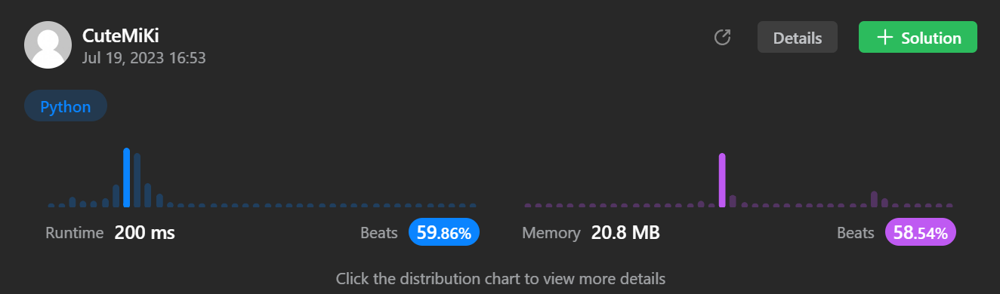

# 238. Product of Array Except Self
## Tag: [Medium](https://github.com/TheOnlyMiki/LeetCode-For-Fun/tree/main#medium-level), [Array](https://github.com/TheOnlyMiki/LeetCode-For-Fun/tree/main#array), [Prefix Sum](https://github.com/TheOnlyMiki/LeetCode-For-Fun/tree/main#prefix-sum)
---
<div class="px-5 pt-4"><div class="flex"></div><div class="_1l1MA" data-track-load="description_content"><p>Given an integer array <code>nums</code>, return <em>an array</em> <code>answer</code> <em>such that</em> <code>answer[i]</code> <em>is equal to the product of all the elements of</em> <code>nums</code> <em>except</em> <code>nums[i]</code>.</p>

<p>The product of any prefix or suffix of <code>nums</code> is <strong>guaranteed</strong> to fit in a <strong>32-bit</strong> integer.</p>

<p>You must write an algorithm that runs in&nbsp;<code>O(n)</code>&nbsp;time and without using the division operation.</p>

<p>&nbsp;</p>
<p><strong class="example">Example 1:</strong></p>
<pre><strong>Input:</strong> nums = [1,2,3,4]
<strong>Output:</strong> [24,12,8,6]
</pre><p><strong class="example">Example 2:</strong></p>
<pre><strong>Input:</strong> nums = [-1,1,0,-3,3]
<strong>Output:</strong> [0,0,9,0,0]
</pre>
<p>&nbsp;</p>
<p><strong>Constraints:</strong></p>

<ul>
	<li><code>2 &lt;= nums.length &lt;= 10<sup>5</sup></code></li>
	<li><code>-30 &lt;= nums[i] &lt;= 30</code></li>
	<li>The product of any prefix or suffix of <code>nums</code> is <strong>guaranteed</strong> to fit in a <strong>32-bit</strong> integer.</li>
</ul>

<p>&nbsp;</p>
<p><strong>Follow up:</strong>&nbsp;Can you solve the problem in <code>O(1)&nbsp;</code>extra&nbsp;space complexity? (The output array <strong>does not</strong> count as extra space for space complexity analysis.)</p>
</div></div>

---


### Solution

```python
class Solution(object):
    def productExceptSelf(self, nums):
        """
        :type nums: List[int]
        :rtype: List[int]
        """
        output = [1]
        n = len(nums)

        #Option 2
        for i in range(1, n):
            output.append(output[i-1] * nums[i-1])

        record = 1
        for i in range(n-1, -1, -1):
            output[i] = record * output[i]
            record = record * nums[i]

        return output

        #Option 1
        """
        left = [1]*n
        right = [1]*n

        #Left
        initial = 1
        for i in range(1, n):
            left[i] = initial * nums[i-1]
            initial = left[i]

        #Right
        initial = 1
        for i in range(1, n):
            right[i] = initial * nums[-i]
            initial = right[i]

        #Combination
        for i in range(n):
            output.append(left[i] * right[-i-1])

        return output
        """
```
