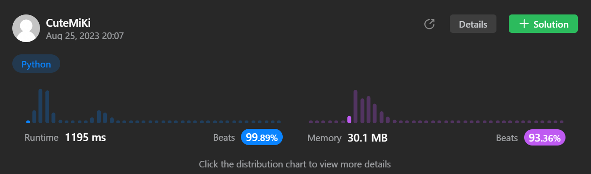

# 239. Sliding Window Maximum
### Tag: [Hard](https://github.com/TheOnlyMiki/LeetCode-For-Fun/tree/main#hard-level), [Array](https://github.com/TheOnlyMiki/LeetCode-For-Fun/tree/main#array), [Queue](https://github.com/TheOnlyMiki/LeetCode-For-Fun/tree/main#queue), [Sliding Window](https://github.com/TheOnlyMiki/LeetCode-For-Fun/tree/main#sliding-window)
---
<div class="px-5 pt-4"><div class="flex"></div><div class="xFUwe" data-track-load="description_content"><p>You are given an array of integers&nbsp;<code>nums</code>, there is a sliding window of size <code>k</code> which is moving from the very left of the array to the very right. You can only see the <code>k</code> numbers in the window. Each time the sliding window moves right by one position.</p>

<p>Return <em>the max sliding window</em>.</p>

<p>&nbsp;</p>
<p><strong class="example">Example 1:</strong></p>

<pre><strong>Input:</strong> nums = [1,3,-1,-3,5,3,6,7], k = 3
<strong>Output:</strong> [3,3,5,5,6,7]
<strong>Explanation:</strong> 
Window position                Max
---------------               -----
[1  3  -1] -3  5  3  6  7       <strong>3</strong>
 1 [3  -1  -3] 5  3  6  7       <strong>3</strong>
 1  3 [-1  -3  5] 3  6  7      <strong> 5</strong>
 1  3  -1 [-3  5  3] 6  7       <strong>5</strong>
 1  3  -1  -3 [5  3  6] 7       <strong>6</strong>
 1  3  -1  -3  5 [3  6  7]      <strong>7</strong>
</pre>

<p><strong class="example">Example 2:</strong></p>

<pre><strong>Input:</strong> nums = [1], k = 1
<strong>Output:</strong> [1]
</pre>

<p>&nbsp;</p>
<p><strong>Constraints:</strong></p>

<ul>
	<li><code>1 &lt;= nums.length &lt;= 10<sup>5</sup></code></li>
	<li><code>-10<sup>4</sup> &lt;= nums[i] &lt;= 10<sup>4</sup></code></li>
	<li><code>1 &lt;= k &lt;= nums.length</code></li>
</ul>
</div></div>

---


### Solution

```python
from collections import deque
class Solution(object):
    def maxSlidingWindow(self, nums, k):
        """
        :type nums: List[int]
        :type k: int
        :rtype: List[int]
        """
        # Option 2 - Queue with Math method
        output = []
        queue = deque()
        num = None

        for i in range(k-1):
            num = nums[i]
            while queue and nums[queue[-1]] < num:
                queue.pop()
            queue.append(i)
        
        for i in range(k-1, len(nums)):
            num = nums[i]

            while queue and nums[queue[-1]] < num:
                queue.pop()

            queue.append(i)
            output.append(nums[queue[0]])

            if queue[0] == i-k+1:
                queue.popleft()

        return output

        # Option 1 - Queue with Max() method, but can't pass cause max method take O(k*n)
        """
        output = []
        queue = deque()

        for i, num in enumerate(nums):
            if i < k:
                queue.append(num)
            else:
                output.append( max(queue) )
                queue.popleft()
                queue.append(num)

        output.append(max(queue))
        return output
        """
```
