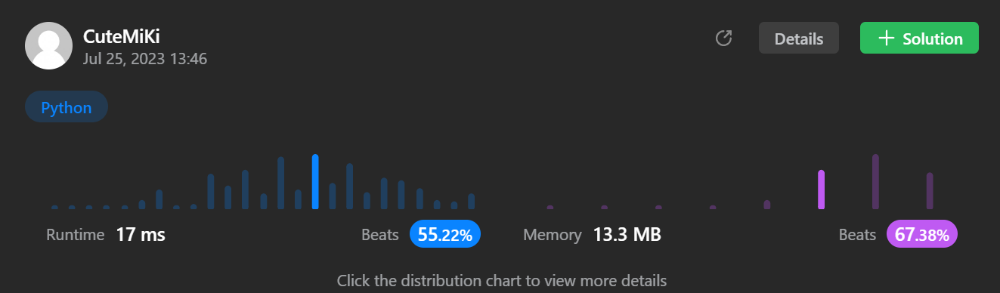

# 290. Word Pattern
### Tag: [Easy](https://github.com/TheOnlyMiki/LeetCode-For-Fun/tree/main#easy-level), [Hash Table](https://github.com/TheOnlyMiki/LeetCode-For-Fun/tree/main#hash-table), [String](https://github.com/TheOnlyMiki/LeetCode-For-Fun/tree/main#string)
---

<div class="px-5 pt-4"><div class="flex"></div><div class="_1l1MA" data-track-load="description_content"><p>Given a <code>pattern</code> and a string <code>s</code>, find if <code>s</code>&nbsp;follows the same pattern.</p>

<p>Here <b>follow</b> means a full match, such that there is a bijection between a letter in <code>pattern</code> and a <b>non-empty</b> word in <code>s</code>.</p>

<p>&nbsp;</p>
<p><strong class="example">Example 1:</strong></p>

<pre><strong>Input:</strong> pattern = "abba", s = "dog cat cat dog"
<strong>Output:</strong> true
</pre>

<p><strong class="example">Example 2:</strong></p>

<pre><strong>Input:</strong> pattern = "abba", s = "dog cat cat fish"
<strong>Output:</strong> false
</pre>

<p><strong class="example">Example 3:</strong></p>

<pre><strong>Input:</strong> pattern = "aaaa", s = "dog cat cat dog"
<strong>Output:</strong> false
</pre>

<p>&nbsp;</p>
<p><strong>Constraints:</strong></p>

<ul>
	<li><code>1 &lt;= pattern.length &lt;= 300</code></li>
	<li><code>pattern</code> contains only lower-case English letters.</li>
	<li><code>1 &lt;= s.length &lt;= 3000</code></li>
	<li><code>s</code> contains only lowercase English letters and spaces <code>' '</code>.</li>
	<li><code>s</code> <strong>does not contain</strong> any leading or trailing spaces.</li>
	<li>All the words in <code>s</code> are separated by a <strong>single space</strong>.</li>
</ul>
</div></div>

---


### Solution

```python
class Solution(object):
    def wordPattern(self, pattern, s):
        """
        :type pattern: str
        :type s: str
        :rtype: bool
        """

        count_p = {}
        count_s = {}

        s = s.split()
        if len(s) != len(pattern):
            return False

        try:
            for i, word in enumerate(s):
                if pattern[i] in count_p or word in count_s:
                    if count_p[pattern[i]] != word or count_s[word] != pattern[i]:
                        return False
                else:
                    count_p[pattern[i]] = word
                    count_s[word] = pattern[i]
        except:
            return False

        return True
```
