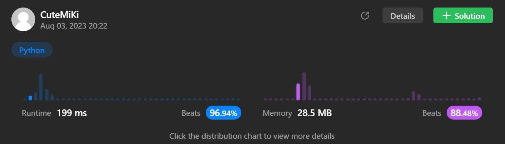

# 200. Number of Islands
### Tag: [Medium](https://github.com/TheOnlyMiki/LeetCode-For-Fun/tree/main#medium-level), [Array](https://github.com/TheOnlyMiki/LeetCode-For-Fun/tree/main#array), [Depth-First Search](https://github.com/TheOnlyMiki/LeetCode-For-Fun/tree/main#depth-first-search), [Breadth-First Search](https://github.com/TheOnlyMiki/LeetCode-For-Fun/tree/main#breadth-first-search), [Union Find](https://github.com/TheOnlyMiki/LeetCode-For-Fun/tree/main#union-find), [Matrix](https://github.com/TheOnlyMiki/LeetCode-For-Fun/tree/main#matrix), [Graph](https://github.com/TheOnlyMiki/LeetCode-For-Fun/tree/main#graph)
---
<div class="px-5 pt-4"><div class="flex"></div><div class="xFUwe" data-track-load="description_content"><p>Given an <code>m x n</code> 2D binary grid <code>grid</code> which represents a map of <code>'1'</code>s (land) and <code>'0'</code>s (water), return <em>the number of islands</em>.</p>

<p>An <strong>island</strong> is surrounded by water and is formed by connecting adjacent lands horizontally or vertically. You may assume all four edges of the grid are all surrounded by water.</p>

<p>&nbsp;</p>
<p><strong class="example">Example 1:</strong></p>

<pre><strong>Input:</strong> grid = [
  ["1","1","1","1","0"],
  ["1","1","0","1","0"],
  ["1","1","0","0","0"],
  ["0","0","0","0","0"]
]
<strong>Output:</strong> 1
</pre>

<p><strong class="example">Example 2:</strong></p>

<pre><strong>Input:</strong> grid = [
  ["1","1","0","0","0"],
  ["1","1","0","0","0"],
  ["0","0","1","0","0"],
  ["0","0","0","1","1"]
]
<strong>Output:</strong> 3
</pre>

<p>&nbsp;</p>
<p><strong>Constraints:</strong></p>

<ul>
	<li><code>m == grid.length</code></li>
	<li><code>n == grid[i].length</code></li>
	<li><code>1 &lt;= m, n &lt;= 300</code></li>
	<li><code>grid[i][j]</code> is <code>'0'</code> or <code>'1'</code>.</li>
</ul>
</div></div>

---


### Solution

```python
class Solution(object):
    def numIslands(self, grid):
        """
        :type grid: List[List[str]]
        :rtype: int
        """
        self.m = len(grid)
        self.n = len(grid[0])
        col = range(self.n)
        output = 0

        # Option 2 - change the land to 0, which is water
        def changeTheLand(neighbors):
            for x, y in neighbors:
                if x == -1 or x == self.m or y == -1 or y == self.n:
                    continue 
                elif grid[x][y] == '1':
                    grid[x][y] = '0'
                    changeTheLand([(x-1, y), (x, y-1), (x, y+1), (x+1, y)])

        for x in range(self.m):
            for y in col:
                if grid[x][y] == '1':
                    grid[x][y] = '0'
                    changeTheLand([(x-1, y), (x, y-1), (x, y+1), (x+1, y)])
                    output += 1
                
        return output

        # Option 1 - marking the land, then skip if the index have been marked
        """
        def markTheLand(neighbors):
            for x, y in neighbors:
                if x == -1 or x == self.m or y == -1 or y == self.n or (x,y) in self.new_map:
                    continue 
                elif grid[x][y] == '1':
                    self.new_map.add((x, y))
                    markTheLand([(x-1, y), (x, y-1), (x, y+1), (x+1, y)])

        self.new_map = set()

        for x in range(self.m):
            for y in col:
                if (x, y) not in self.new_map and grid[x][y] == '1':
                    self.new_map.add((x, y))
                    markTheLand([(x-1, y), (x, y-1), (x, y+1), (x+1, y)])
                    output += 1
                
        return output
        """
```
