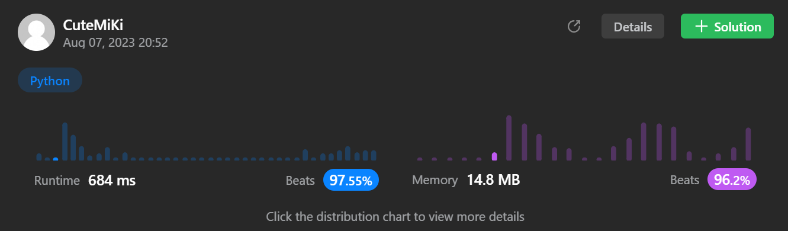

# 212. Word Search II
### Tag: [Hard](https://github.com/TheOnlyMiki/LeetCode-For-Fun/tree/main#hard-level), [Array](https://github.com/TheOnlyMiki/LeetCode-For-Fun/tree/main#array), [String](https://github.com/TheOnlyMiki/LeetCode-For-Fun/tree/main#string), [Backtracking](https://github.com/TheOnlyMiki/LeetCode-For-Fun/tree/main#backtracking), [Trie](https://github.com/TheOnlyMiki/LeetCode-For-Fun/tree/main#trie), [Matrix](https://github.com/TheOnlyMiki/LeetCode-For-Fun/tree/main#matrix)
---
<div class="px-5 pt-4"><div class="flex"></div><div class="xFUwe" data-track-load="description_content"><p>Given an <code>m x n</code> <code>board</code>&nbsp;of characters and a list of strings <code>words</code>, return <em>all words on the board</em>.</p>

<p>Each word must be constructed from letters of sequentially adjacent cells, where <strong>adjacent cells</strong> are horizontally or vertically neighboring. The same letter cell may not be used more than once in a word.</p>

<p>&nbsp;</p>
<p><strong class="example">Example 1:</strong></p>

<pre><strong>Input:</strong> board = [["o","a","a","n"],["e","t","a","e"],["i","h","k","r"],["i","f","l","v"]], words = ["oath","pea","eat","rain"]
<strong>Output:</strong> ["eat","oath"]
</pre>

<p><strong class="example">Example 2:</strong></p>

<pre><strong>Input:</strong> board = [["a","b"],["c","d"]], words = ["abcb"]
<strong>Output:</strong> []
</pre>

<p>&nbsp;</p>
<p><strong>Constraints:</strong></p>

<ul>
	<li><code>m == board.length</code></li>
	<li><code>n == board[i].length</code></li>
	<li><code>1 &lt;= m, n &lt;= 12</code></li>
	<li><code>board[i][j]</code> is a lowercase English letter.</li>
	<li><code>1 &lt;= words.length &lt;= 3 * 10<sup>4</sup></code></li>
	<li><code>1 &lt;= words[i].length &lt;= 10</code></li>
	<li><code>words[i]</code> consists of lowercase English letters.</li>
	<li>All the strings of <code>words</code> are unique.</li>
</ul>
</div></div>

---


### Solution

```python
class Solution(object):
    def findWords(self, board, words):
        """
        :type board: List[List[str]]
        :type words: List[str]
        :rtype: List[str]
        """
        # Option 3 
        head = {}

        def insert(word):
            """
            :type word: str
            :rtype: None
            """
            temp = head
            for c in word:
                if c in temp:
                    temp = temp[c]
                else:
                    temp[c] = {}
                    temp = temp[c]

            temp[True] = word

        for word in words:
            insert(word)

        m = len(board)
        n = len(board[0])
        rows = range(m)
        cols = range(n)

        output = []

        def checkWordDFS(x, y, next_level):
            c = board[x][y]
            board[x][y] = None
            temp = next_level[c]
            wordMatch = temp.pop(True, False)
            
            if wordMatch:
                output.append(wordMatch)
            
            for a, b in [(-1, 0), (1, 0), (0, -1), (0, 1)]:
                next_x, next_y = x+a, y+b
                if -1 < next_x < m and -1 < next_y < n and board[next_x][next_y] in temp:
                    checkWordDFS(next_x, next_y, temp)

            board[x][y] = c

            if not temp:
                del next_level[c]

        for x in rows:
            for y in cols:
                if board[x][y] in head:
                    checkWordDFS(x, y, head)

        return output

        # Option 2 - Trie + DFS, but also too slow
        '''
        head = {'#':0}

        def insert(word):
            """
            :type word: str
            :rtype: None
            """
            temp = head
            for c in word:
                temp['#'] += 1
                if c in temp:
                    temp = temp[c]
                else:
                    temp[c] = {'#':1}
                    temp = temp[c]

            temp[True] = word

        for word in words:
            insert(word)

        m = len(board)
        n = len(board[0])
        rows = range(m)
        cols = range(n)

        output = []
        visit = set()

        def checkWordDFS(x, y, next_level):
            if next_level['#'] == 0 or (x, y) in visit or x < 0 or x == m or y < 0 or y == n or board[x][y] not in next_level:
                return False

            visit.add((x,y))
            temp = next_level[board[x][y]]
            found = False
            if True in temp:
                output.append(temp[True])
                del temp[True]
                temp['#'] -= 1
                next_level['#'] -= 1
                found = True
            
            for a, b in [(-1, 0), (1, 0), (0, -1), (0, 1)]:
                if checkWordDFS(x+a, y+b, temp):
                    next_level['#'] -= 1
                    found = True

            visit.remove((x,y))

            return found

        for x in rows:
            for y in cols:
                checkWordDFS(x, y, head)

        return output
        '''

        # Option 1 - DFS, too slow, can't pass
        '''
        rows = range(len(board))
        cols = range(len(board[0]))

        prefix = set()
        record = { c:set() for c in "abcdefghijklmnopqrstuvwxyz" }
        neighbors = {}

        x_left = x_right = None
        for x in rows:
            x_left = x-1
            x_right = x+1
            for y in cols:
                prefix.add(board[x][y])
                record[board[x][y]].add((x, y))
                neighbors[(x,y)] = {(x_left, y), (x_right, y), (x, y-1), (x, y+1)}

        self.visit = set()

        def checkNeighborsDFS(word, index, length, coordinates):
            if not coordinates:
                return False
            if index == length:
                return True
            if word[index] not in prefix:
                return False
            
            for coordinate in coordinates:
                if coordinate not in self.visit:
                    self.visit.add(coordinate)
                    if checkNeighborsDFS(
                        word, 
                        index+1, 
                        length, 
                        neighbors[coordinate] & record[word[index]] - self.visit
                        ):
                        self.visit = set()
                        return True
                    self.visit.remove(coordinate)

            return False
        
        output = []

        for word in words:
            if checkNeighborsDFS(word, 1, len(word), record[word[0]]):
                output.append(word)

        return output
        '''
```
