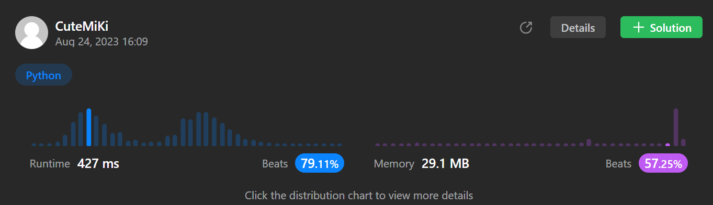

# 217. Contains Duplicate
### Tag: [Easy](https://github.com/TheOnlyMiki/LeetCode-For-Fun/tree/main#easy-level), [Array](https://github.com/TheOnlyMiki/LeetCode-For-Fun/tree/main#array), [Hash Table](https://github.com/TheOnlyMiki/LeetCode-For-Fun/tree/main#hash-table), [Sorting](https://github.com/TheOnlyMiki/LeetCode-For-Fun/tree/main#sorting)
---
<div class="px-5 pt-4"><div class="flex"></div><div class="xFUwe" data-track-load="description_content"><p>Given an integer array <code>nums</code>, return <code>true</code> if any value appears <strong>at least twice</strong> in the array, and return <code>false</code> if every element is distinct.</p>

<p>&nbsp;</p>
<p><strong class="example">Example 1:</strong></p>
<pre><strong>Input:</strong> nums = [1,2,3,1]
<strong>Output:</strong> true
</pre><p><strong class="example">Example 2:</strong></p>
<pre><strong>Input:</strong> nums = [1,2,3,4]
<strong>Output:</strong> false
</pre><p><strong class="example">Example 3:</strong></p>
<pre><strong>Input:</strong> nums = [1,1,1,3,3,4,3,2,4,2]
<strong>Output:</strong> true
</pre>
<p>&nbsp;</p>
<p><strong>Constraints:</strong></p>

<ul>
	<li><code>1 &lt;= nums.length &lt;= 10<sup>5</sup></code></li>
	<li><code>-10<sup>9</sup> &lt;= nums[i] &lt;= 10<sup>9</sup></code></li>
</ul>
</div></div>

---


### Solution

```python
class Solution(object):
    def containsDuplicate(self, nums):
        """
        :type nums: List[int]
        :rtype: bool
        """
        record = set()
        for num in nums:
            if num in record:
                return True
            record.add(num)

        return False
```
