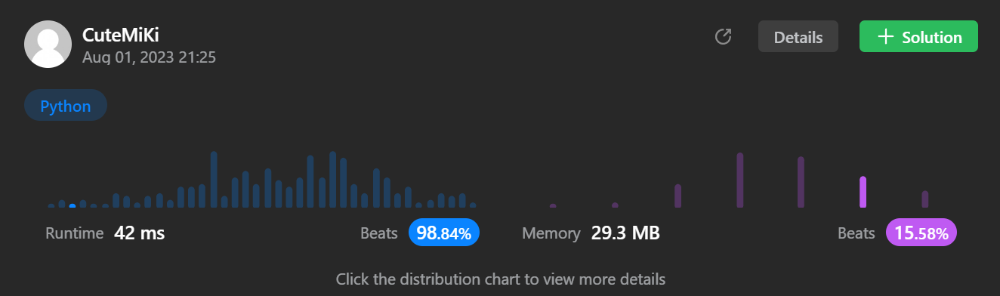

# 222. Count Complete Tree Nodes
### Tag: [Easy](https://github.com/TheOnlyMiki/LeetCode-For-Fun/tree/main#easy-level), [Binary Search](https://github.com/TheOnlyMiki/LeetCode-For-Fun/tree/main#binary-search), [Depth-First Search](https://github.com/TheOnlyMiki/LeetCode-For-Fun/tree/main#depth-first-search), [Breadth-First Search](https://github.com/TheOnlyMiki/LeetCode-For-Fun/tree/main#breadth-first-search), [Binary Tree](https://github.com/TheOnlyMiki/LeetCode-For-Fun/tree/main#binary-tree)
---
<div class="px-5 pt-4"><div class="flex"></div><div class="_1l1MA" data-track-load="description_content"><p>Given the <code>root</code> of a <strong>complete</strong> binary tree, return the number of the nodes in the tree.</p>

<p>According to <strong><a href="http://en.wikipedia.org/wiki/Binary_tree#Types_of_binary_trees" target="_blank">Wikipedia</a></strong>, every level, except possibly the last, is completely filled in a complete binary tree, and all nodes in the last level are as far left as possible. It can have between <code>1</code> and <code>2<sup>h</sup></code> nodes inclusive at the last level <code>h</code>.</p>

<p>Design an algorithm that runs in less than&nbsp;<code data-stringify-type="code">O(n)</code>&nbsp;time complexity.</p>

<p>&nbsp;</p>
<p><strong class="example">Example 1:</strong></p>

<pre><strong>Input:</strong> root = [1,2,3,4,5,6]
<strong>Output:</strong> 6
</pre>

<p><strong class="example">Example 2:</strong></p>

<pre><strong>Input:</strong> root = []
<strong>Output:</strong> 0
</pre>

<p><strong class="example">Example 3:</strong></p>

<pre><strong>Input:</strong> root = [1]
<strong>Output:</strong> 1
</pre>

<p>&nbsp;</p>
<p><strong>Constraints:</strong></p>

<ul>
	<li>The number of nodes in the tree is in the range <code>[0, 5 * 10<sup>4</sup>]</code>.</li>
	<li><code>0 &lt;= Node.val &lt;= 5 * 10<sup>4</sup></code></li>
	<li>The tree is guaranteed to be <strong>complete</strong>.</li>
</ul>
</div></div>

---


### Solution

```python
# Definition for a binary tree node.
# class TreeNode(object):
#     def __init__(self, val=0, left=None, right=None):
#         self.val = val
#         self.left = left
#         self.right = right
class Solution(object):
    def countNodes(self, root):
        """
        :type root: TreeNode
        :rtype: int
        """

        def getNumbers(root):
            level = 0
            left_node = right_node = root
            right_level = 0
            while left_node:
                left_node = left_node.left
                level += 1
                if right_node:
                    right_node = right_node.right
                    right_level = level

            if right_level == level:
                return 2**level - 1
            return getNumbers(root.left) + 1 + getNumbers(root.right)

        return getNumbers(root)

        # Option 1 - O(n), no idea why it was beats 95%, it should be slowly cause O(n)
        """
        def getNumbers(root):
            if not root:
                return 0

            return getNumbers(root.left) + 1 + getNumbers(root.right)

        return getNumbers(root)
        """
```
