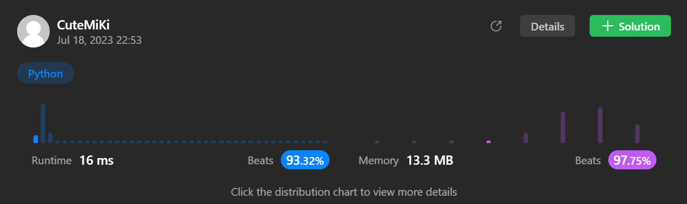

# 274. H-Index
### Tag: [Medium](https://github.com/TheOnlyMiki/LeetCode-For-Fun/tree/main#medium-level), [Array](https://github.com/TheOnlyMiki/LeetCode-For-Fun/tree/main#array), [Sorting](https://github.com/TheOnlyMiki/LeetCode-For-Fun/tree/main#sorting), [Counting](https://github.com/TheOnlyMiki/LeetCode-For-Fun/tree/main#counting)
---
<div class="px-5 pt-4"><div class="flex"></div><div class="_1l1MA" data-track-load="description_content"><p>Given an array of integers <code>citations</code> where <code>citations[i]</code> is the number of citations a researcher received for their <code>i<sup>th</sup></code> paper, return <em>the researcher's h-index</em>.</p>

<p>According to the <a href="https://en.wikipedia.org/wiki/H-index" target="_blank">definition of h-index on Wikipedia</a>: The h-index is defined as the maximum value of <code>h</code> such that the given researcher has published at least <code>h</code> papers that have each been cited at least <code>h</code> times.</p>

<p>&nbsp;</p>
<p><strong class="example">Example 1:</strong></p>

<pre><strong>Input:</strong> citations = [3,0,6,1,5]
<strong>Output:</strong> 3
<strong>Explanation:</strong> [3,0,6,1,5] means the researcher has 5 papers in total and each of them had received 3, 0, 6, 1, 5 citations respectively.
Since the researcher has 3 papers with at least 3 citations each and the remaining two with no more than 3 citations each, their h-index is 3.
</pre>

<p><strong class="example">Example 2:</strong></p>

<pre><strong>Input:</strong> citations = [1,3,1]
<strong>Output:</strong> 1
</pre>

<p>&nbsp;</p>
<p><strong>Constraints:</strong></p>

<ul>
	<li><code>n == citations.length</code></li>
	<li><code>1 &lt;= n &lt;= 5000</code></li>
	<li><code>0 &lt;= citations[i] &lt;= 1000</code></li>
</ul>
</div></div>

---


### Solution

```python
class Solution(object):
    def hIndex(self, citations):
        """
        :type citations: List[int]
        :rtype: int
        """

        #Option 2
        citations.sort()
        h = 0

        #The lowest of the maximum of cites or the maximum of publics
        max_h = min(len(citations), citations[-1])
        for i in range(1, max_h+1):
            if i <= citations[-i]:
                h+=1

        return h
        
        #Option 1
        """
        n = len(citations)
        count = { i:0 for i in range(n+1) }

        for value in citations:
            if value in count:
                count[value] += 1
            else:
                count[n] += 1

        for i in range(n, 0, -1):
            if count[i] >= i:
                return i
            else:
                count[i-1] += count[i]

        return 0
        """
```
