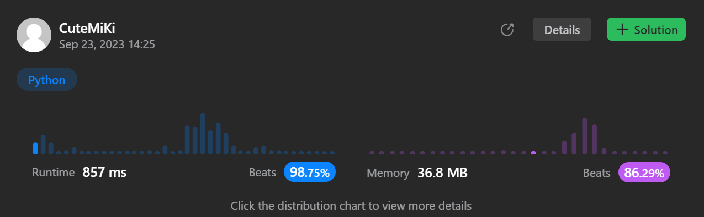

# 2300. Successful Pairs of Spells and Potions
### Tag: [Medium](https://github.com/TheOnlyMiki/LeetCode-For-Fun/tree/main#medium-level), [Array](https://github.com/TheOnlyMiki/LeetCode-For-Fun/tree/main#array), [Two Pointers](https://github.com/TheOnlyMiki/LeetCode-For-Fun/tree/main#two-pointers), [Binary Search](https://github.com/TheOnlyMiki/LeetCode-For-Fun/tree/main#binary-search), [Sorting](https://github.com/TheOnlyMiki/LeetCode-For-Fun/tree/main#sorting)
---
<div class="px-5 pt-4"><div class="flex"></div><div class="xFUwe" data-track-load="description_content"><p>You are given two positive integer arrays <code>spells</code> and <code>potions</code>, of length <code>n</code> and <code>m</code> respectively, where <code>spells[i]</code> represents the strength of the <code>i<sup>th</sup></code> spell and <code>potions[j]</code> represents the strength of the <code>j<sup>th</sup></code> potion.</p>

<p>You are also given an integer <code>success</code>. A spell and potion pair is considered <strong>successful</strong> if the <strong>product</strong> of their strengths is <strong>at least</strong> <code>success</code>.</p>

<p>Return <em>an integer array </em><code>pairs</code><em> of length </em><code>n</code><em> where </em><code>pairs[i]</code><em> is the number of <strong>potions</strong> that will form a successful pair with the </em><code>i<sup>th</sup></code><em> spell.</em></p>

<p>&nbsp;</p>
<p><strong class="example">Example 1:</strong></p>

<pre><strong>Input:</strong> spells = [5,1,3], potions = [1,2,3,4,5], success = 7
<strong>Output:</strong> [4,0,3]
<strong>Explanation:</strong>
- 0<sup>th</sup> spell: 5 * [1,2,3,4,5] = [5,<u><strong>10</strong></u>,<u><strong>15</strong></u>,<u><strong>20</strong></u>,<u><strong>25</strong></u>]. 4 pairs are successful.
- 1<sup>st</sup> spell: 1 * [1,2,3,4,5] = [1,2,3,4,5]. 0 pairs are successful.
- 2<sup>nd</sup> spell: 3 * [1,2,3,4,5] = [3,6,<u><strong>9</strong></u>,<u><strong>12</strong></u>,<u><strong>15</strong></u>]. 3 pairs are successful.
Thus, [4,0,3] is returned.
</pre>

<p><strong class="example">Example 2:</strong></p>

<pre><strong>Input:</strong> spells = [3,1,2], potions = [8,5,8], success = 16
<strong>Output:</strong> [2,0,2]
<strong>Explanation:</strong>
- 0<sup>th</sup> spell: 3 * [8,5,8] = [<u><strong>24</strong></u>,15,<u><strong>24</strong></u>]. 2 pairs are successful.
- 1<sup>st</sup> spell: 1 * [8,5,8] = [8,5,8]. 0 pairs are successful. 
- 2<sup>nd</sup> spell: 2 * [8,5,8] = [<strong><u>16</u></strong>,10,<u><strong>16</strong></u>]. 2 pairs are successful. 
Thus, [2,0,2] is returned.
</pre>

<p>&nbsp;</p>
<p><strong>Constraints:</strong></p>

<ul>
	<li><code>n == spells.length</code></li>
	<li><code>m == potions.length</code></li>
	<li><code>1 &lt;= n, m &lt;= 10<sup>5</sup></code></li>
	<li><code>1 &lt;= spells[i], potions[i] &lt;= 10<sup>5</sup></code></li>
	<li><code>1 &lt;= success &lt;= 10<sup>10</sup></code></li>
</ul>
</div></div>

---


### Solution

```python
class Solution(object):
    def successfulPairs(self, spells, potions, success):
        """
        :type spells: List[int]
        :type potions: List[int]
        :type success: int
        :rtype: List[int]
        """
        # Option 3
        """
        potions = sorted(potions)
        length = len(potions)
        
        output = []
        for num in spells:
            output.append(length - bisect_left(potions, (success + num - 1) // num))

        return output
        """

        # Option 2
        potions = sorted(potions, reverse=True)
        length = len(potions)

        for i, num in enumerate(potions):
            potions[i] = (success - 1) / num + 1

        def binarySearch(num):
            left, right = 0, length
            while left < right:
                mid = (left + right) // 2
                if potions[mid] > num:
                    right = mid
                else:
                    left = mid + 1

            return left
        
        output = []
        for num in spells:
            # Bisect_left would be same speed as Option 3
            #output.append(bisect_left(potions,num+1))
            output.append(binarySearch(num))

        return output

        # Option 1
        """
        potions = sorted(potions)
        length = len(potions)

        def binarySearch(num):
            left, right = 0, length
            while left < right:
                mid = (left + right) // 2
                temp = potions[mid] * num
                if temp < success:
                    left = mid + 1
                else:
                    right = mid

            return length - left
        
        output = []
        for num in spells:
            output.append(binarySearch(num))

        return output
        """
```
