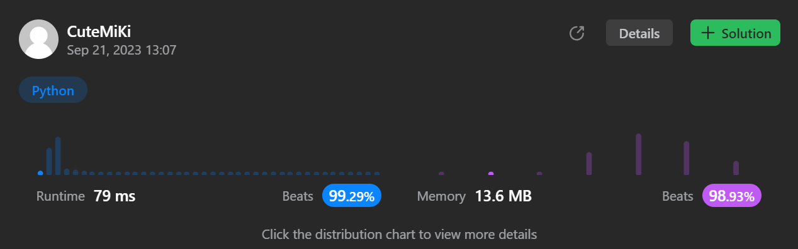

# 2336. Smallest Number in Infinite Set
### Tag: [Medium](https://github.com/TheOnlyMiki/LeetCode-For-Fun/tree/main#medium-level), [Hash Table](https://github.com/TheOnlyMiki/LeetCode-For-Fun/tree/main#hash-table), [Design](https://github.com/TheOnlyMiki/LeetCode-For-Fun/tree/main#design), [Queue](https://github.com/TheOnlyMiki/LeetCode-For-Fun/tree/main#queue)
---
<div class="px-5 pt-4"><div class="flex"></div><div class="xFUwe" data-track-load="description_content"><p>You have a set which contains all positive integers <code>[1, 2, 3, 4, 5, ...]</code>.</p>

<p>Implement the <code>SmallestInfiniteSet</code> class:</p>

<ul>
	<li><code>SmallestInfiniteSet()</code> Initializes the <strong>SmallestInfiniteSet</strong> object to contain <strong>all</strong> positive integers.</li>
	<li><code>int popSmallest()</code> <strong>Removes</strong> and returns the smallest integer contained in the infinite set.</li>
	<li><code>void addBack(int num)</code> <strong>Adds</strong> a positive integer <code>num</code> back into the infinite set, if it is <strong>not</strong> already in the infinite set.</li>
</ul>

<p>&nbsp;</p>
<p><strong class="example">Example 1:</strong></p>

<pre><strong>Input</strong>
["SmallestInfiniteSet", "addBack", "popSmallest", "popSmallest", "popSmallest", "addBack", "popSmallest", "popSmallest", "popSmallest"]
[[], [2], [], [], [], [1], [], [], []]
<strong>Output</strong>
[null, null, 1, 2, 3, null, 1, 4, 5]

<strong>Explanation</strong>
SmallestInfiniteSet smallestInfiniteSet = new SmallestInfiniteSet();
smallestInfiniteSet.addBack(2);    // 2 is already in the set, so no change is made.
smallestInfiniteSet.popSmallest(); // return 1, since 1 is the smallest number, and remove it from the set.
smallestInfiniteSet.popSmallest(); // return 2, and remove it from the set.
smallestInfiniteSet.popSmallest(); // return 3, and remove it from the set.
smallestInfiniteSet.addBack(1);    // 1 is added back to the set.
smallestInfiniteSet.popSmallest(); // return 1, since 1 was added back to the set and
                                   // is the smallest number, and remove it from the set.
smallestInfiniteSet.popSmallest(); // return 4, and remove it from the set.
smallestInfiniteSet.popSmallest(); // return 5, and remove it from the set.
</pre>

<p>&nbsp;</p>
<p><strong>Constraints:</strong></p>

<ul>
	<li><code>1 &lt;= num &lt;= 1000</code></li>
	<li>At most <code>1000</code> calls will be made <strong>in total</strong> to <code>popSmallest</code> and <code>addBack</code>.</li>
</ul>
</div></div>

---


### Solution

```python
# Option 2
import heapq
class SmallestInfiniteSet(object):

    def __init__(self):
        self.small = 1
        self.visit = set()
        self.queue = []

    def popSmallest(self):
        if self.queue:
            self.visit.remove(self.queue[0])
            return heapq.heappop(self.queue)
        
        self.small += 1
        return self.small-1

    def addBack(self, num):
        if num > 0 and self.small > num and num not in self.visit:
            heapq.heappush(self.queue, num)
            self.visit.add(num)
                
# Option 1
"""
class SmallestInfiniteSet(object):

    def __init__(self):
        self.small = 1
        self.queue = set()

    def popSmallest(self):
        while self.small in self.queue:
            self.small += 1

        self.queue.add(self.small)

        return self.small

    def addBack(self, num):
        if num > 0 and num in self.queue:
            self.queue.remove(num)
            if self.small > num:
                self.small = num"""

# Your SmallestInfiniteSet object will be instantiated and called as such:
# obj = SmallestInfiniteSet()
# param_1 = obj.popSmallest()
# obj.addBack(num)
```
