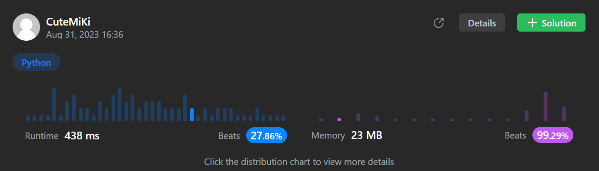

# 2366. Minimum Replacements to Sort the Array
### Tag: [Hard](https://github.com/TheOnlyMiki/LeetCode-For-Fun/tree/main#hard-level), [Array](https://github.com/TheOnlyMiki/LeetCode-For-Fun/tree/main#array), [Math](https://github.com/TheOnlyMiki/LeetCode-For-Fun/tree/main#math), [Greedy](https://github.com/TheOnlyMiki/LeetCode-For-Fun/tree/main#greedy)
---
<div class="px-5 pt-4"><div class="flex"></div><div class="xFUwe" data-track-load="description_content"><p>You are given a <strong>0-indexed</strong> integer array <code>nums</code>. In one operation you can replace any element of the array with <strong>any two</strong> elements that <strong>sum</strong> to it.</p>

<ul>
	<li>For example, consider <code>nums = [5,6,7]</code>. In one operation, we can replace <code>nums[1]</code> with <code>2</code> and <code>4</code> and convert <code>nums</code> to <code>[5,2,4,7]</code>.</li>
</ul>

<p>Return <em>the minimum number of operations to make an array that is sorted in <strong>non-decreasing</strong> order</em>.</p>

<p>&nbsp;</p>
<p><strong class="example">Example 1:</strong></p>

<pre><strong>Input:</strong> nums = [3,9,3]
<strong>Output:</strong> 2
<strong>Explanation:</strong> Here are the steps to sort the array in non-decreasing order:
- From [3,9,3], replace the 9 with 3 and 6 so the array becomes [3,3,6,3]
- From [3,3,6,3], replace the 6 with 3 and 3 so the array becomes [3,3,3,3,3]
There are 2 steps to sort the array in non-decreasing order. Therefore, we return 2.

</pre>

<p><strong class="example">Example 2:</strong></p>

<pre><strong>Input:</strong> nums = [1,2,3,4,5]
<strong>Output:</strong> 0
<strong>Explanation:</strong> The array is already in non-decreasing order. Therefore, we return 0. 
</pre>

<p>&nbsp;</p>
<p><strong>Constraints:</strong></p>

<ul>
	<li><code>1 &lt;= nums.length &lt;= 10<sup>5</sup></code></li>
	<li><code>1 &lt;= nums[i] &lt;= 10<sup>9</sup></code></li>
</ul>
</div></div>

---


### Solution

```python
class Solution(object):
    def minimumReplacement(self, nums):
        """
        :type nums: List[int]
        :rtype: int
        """
        # Option 2
        output = 0
        previou_lower = nums[-1]
        temp = None

        for i in range(len(nums)-2, -1, -1):
        #for num in nums[::-1]:
            if previou_lower < nums[i]:
                temp = (previou_lower + nums[i] - 1) / previou_lower
                nums[i] /= temp
                output += temp - 1
            
            previou_lower = nums[i]

        return output
        
        # Option 1
        output = 0
        previou_lower = nums[-1]
        temp1 = temp2 = None

        for i in range(len(nums)-2, -1, -1):
            if previou_lower < nums[i]:
                temp1, temp2 = divmod(nums[i], previou_lower)
                if temp2 > 0:
                    temp1 += 1

                nums[i] //= temp1
                output += temp1 - 1

            previou_lower = nums[i]

        return output
```
