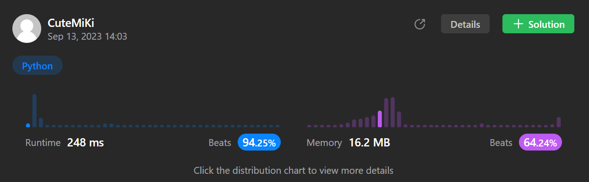

# 2390. Removing Stars From a String
### Tag: [Medium](https://github.com/TheOnlyMiki/LeetCode-For-Fun/tree/main#medium-level), [String](https://github.com/TheOnlyMiki/LeetCode-For-Fun/tree/main#string), [Stack](https://github.com/TheOnlyMiki/LeetCode-For-Fun/tree/main#stack)
---
<div class="px-5 pt-4"><div class="flex"></div><div class="xFUwe" data-track-load="description_content"><p>You are given a string <code>s</code>, which contains stars <code>*</code>.</p>

<p>In one operation, you can:</p>

<ul>
	<li>Choose a star in <code>s</code>.</li>
	<li>Remove the closest <strong>non-star</strong> character to its <strong>left</strong>, as well as remove the star itself.</li>
</ul>

<p>Return <em>the string after <strong>all</strong> stars have been removed</em>.</p>

<p><strong>Note:</strong></p>

<ul>
	<li>The input will be generated such that the operation is always possible.</li>
	<li>It can be shown that the resulting string will always be unique.</li>
</ul>

<p>&nbsp;</p>
<p><strong class="example">Example 1:</strong></p>

<pre><strong>Input:</strong> s = "leet**cod*e"
<strong>Output:</strong> "lecoe"
<strong>Explanation:</strong> Performing the removals from left to right:
- The closest character to the 1<sup>st</sup> star is 't' in "lee<strong><u>t</u></strong>**cod*e". s becomes "lee*cod*e".
- The closest character to the 2<sup>nd</sup> star is 'e' in "le<strong><u>e</u></strong>*cod*e". s becomes "lecod*e".
- The closest character to the 3<sup>rd</sup> star is 'd' in "leco<strong><u>d</u></strong>*e". s becomes "lecoe".
There are no more stars, so we return "lecoe".</pre>

<p><strong class="example">Example 2:</strong></p>

<pre><strong>Input:</strong> s = "erase*****"
<strong>Output:</strong> ""
<strong>Explanation:</strong> The entire string is removed, so we return an empty string.
</pre>

<p>&nbsp;</p>
<p><strong>Constraints:</strong></p>

<ul>
	<li><code>1 &lt;= s.length &lt;= 10<sup>5</sup></code></li>
	<li><code>s</code> consists of lowercase English letters and stars <code>*</code>.</li>
	<li>The operation above can be performed on <code>s</code>.</li>
</ul>
</div></div>
---


### Solution

```python
class Solution(object):
    def removeStars(self, s):
        """
        :type s: str
        :rtype: str
        """
        stack = []
        for c in s:
            if c == '*':
                stack.pop()
            else:
                stack.append(c)

        return ''.join(stack)
```
