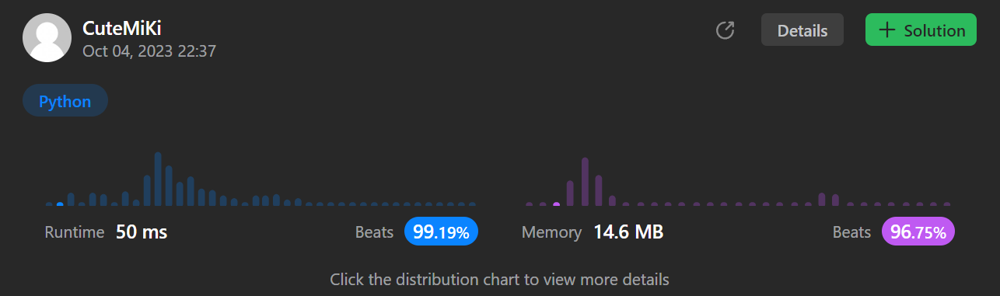

# 2405. Optimal Partition of String
### Tag: [Medium](https://github.com/TheOnlyMiki/LeetCode-For-Fun/tree/main#medium-level), [Hash Table](https://github.com/TheOnlyMiki/LeetCode-For-Fun/tree/main#hash-table), [String](https://github.com/TheOnlyMiki/LeetCode-For-Fun/tree/main#string), [Greedy](https://github.com/TheOnlyMiki/LeetCode-For-Fun/tree/main#greedy)
---
<div class="px-5 pt-4"><div class="flex"></div><div class="xFUwe" data-track-load="description_content"><p>Given a string <code>s</code>, partition the string into one or more <strong>substrings</strong> such that the characters in each substring are <strong>unique</strong>. That is, no letter appears in a single substring more than <strong>once</strong>.</p>

<p>Return <em>the <strong>minimum</strong> number of substrings in such a partition.</em></p>

<p>Note that each character should belong to exactly one substring in a partition.</p>

<p>&nbsp;</p>
<p><strong class="example">Example 1:</strong></p>

<pre><strong>Input:</strong> s = "abacaba"
<strong>Output:</strong> 4
<strong>Explanation:</strong>
Two possible partitions are ("a","ba","cab","a") and ("ab","a","ca","ba").
It can be shown that 4 is the minimum number of substrings needed.
</pre>

<p><strong class="example">Example 2:</strong></p>

<pre><strong>Input:</strong> s = "ssssss"
<strong>Output:</strong> 6
<strong>Explanation:
</strong>The only valid partition is ("s","s","s","s","s","s").
</pre>

<p>&nbsp;</p>
<p><strong>Constraints:</strong></p>

<ul>
	<li><code>1 &lt;= s.length &lt;= 10<sup>5</sup></code></li>
	<li><code>s</code> consists of only English lowercase letters.</li>
</ul>
</div></div>

---


### Solution

```python
class Solution(object):
    def partitionString(self, s):
        """
        :type s: str
        :rtype: int
        """
        output = 1
        #visit = set()
        visit = ""
        for c in s:
            if c in visit:
                output += 1
                #visit = {c}
                visit = c
            else:
                #visit.add(c)
                visit += c

        return output
```
