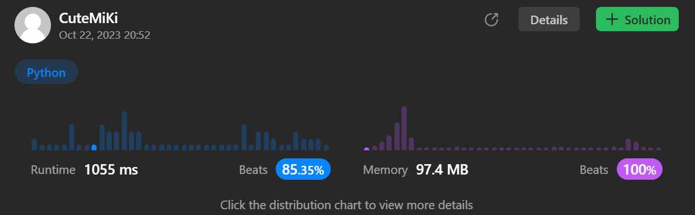

# 2487. Remove Nodes From Linked List
### Tag: [Medium](https://github.com/TheOnlyMiki/LeetCode-For-Fun/tree/main#medium-level), [Linked List](https://github.com/TheOnlyMiki/LeetCode-For-Fun/tree/main#linked-list), [Stack](https://github.com/TheOnlyMiki/LeetCode-For-Fun/tree/main#stack)
---
<div class="px-5 pt-4"><div class="flex"></div><div class="xFUwe" data-track-load="description_content"><p>You are given the <code>head</code> of a linked list.</p>

<p>Remove every node which has a node with a greater value anywhere to the right side of it.</p>

<p>Return <em>the </em><code>head</code><em> of the modified linked list.</em></p>

<p>&nbsp;</p>
<p><strong class="example">Example 1:</strong></p>

<pre><strong>Input:</strong> head = [5,2,13,3,8]
<strong>Output:</strong> [13,8]
<strong>Explanation:</strong> The nodes that should be removed are 5, 2 and 3.
- Node 13 is to the right of node 5.
- Node 13 is to the right of node 2.
- Node 8 is to the right of node 3.
</pre>

<p><strong class="example">Example 2:</strong></p>

<pre><strong>Input:</strong> head = [1,1,1,1]
<strong>Output:</strong> [1,1,1,1]
<strong>Explanation:</strong> Every node has value 1, so no nodes are removed.
</pre>

<p>&nbsp;</p>
<p><strong>Constraints:</strong></p>

<ul>
	<li>The number of the nodes in the given list is in the range <code>[1, 10<sup>5</sup>]</code>.</li>
	<li><code>1 &lt;= Node.val &lt;= 10<sup>5</sup></code></li>
</ul>
</div></div>

---


### Solution

```python
# Definition for singly-linked list.
# class ListNode(object):
#     def __init__(self, val=0, next=None):
#         self.val = val
#         self.next = next
class Solution(object):
    def removeNodes(self, head):
        """
        :type head: Optional[ListNode]
        :rtype: Optional[ListNode]
        """
        # Option 2
        stack = [ListNode(1e6)]
        while head:
            while stack[-1].val < head.val:
                stack.pop()

            stack[-1].next = head
            stack.append(head)
            head = head.next

        return stack[1]

        # Option 1
        """
        stack = []
        while head:
            while stack and stack[-1].val < head.val:
                stack.pop()

            if stack: stack[-1].next = head
                
            stack.append(head)
            head = head.next

        '''
        i = 1
        while i < len(stack):
            stack[i-1].next, i = stack[i], i+1
            '''

        return stack[0]
        """
```
