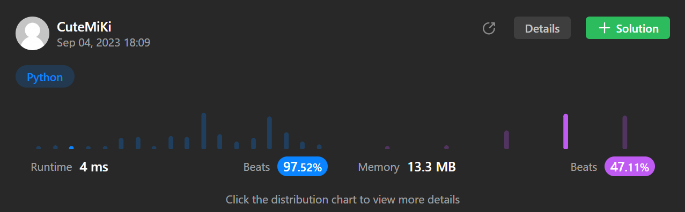

# 2806. Account Balance After Rounded Purchase
### Tag: [Easy](https://github.com/TheOnlyMiki/LeetCode-For-Fun/tree/main#easy-level), [Math](https://github.com/TheOnlyMiki/LeetCode-For-Fun/tree/main#math)
---
<div class="px-5 pt-4"><div class="flex"></div><div class="xFUwe" data-track-load="description_content"><p>Initially, you have a bank account balance of <code>100</code> dollars.</p>

<p>You are given an integer <code>purchaseAmount</code> representing the amount you will spend on a purchase in dollars.</p>

<p>At the store where you will make the purchase, the purchase amount is rounded to the <strong>nearest multiple</strong> of <code>10</code>. In other words, you pay a <strong>non-negative</strong> amount, <code>roundedAmount</code>, such that <code>roundedAmount</code> is a multiple of <code>10</code> and <code>abs(roundedAmount - purchaseAmount)</code> is <strong>minimized</strong>.</p>

<p>If there is more than one nearest multiple of <code>10</code>, the <strong>largest multiple</strong> is chosen.</p>

<p>Return <em>an integer denoting your account balance after making a purchase worth </em><code>purchaseAmount</code><em> dollars from the store.</em></p>

<p><strong>Note:</strong> <code>0</code> is considered to be a multiple of <code>10</code> in this problem.</p>

<p>&nbsp;</p>
<p><strong class="example">Example 1:</strong></p>

<pre><strong>Input:</strong> purchaseAmount = 9
<strong>Output:</strong> 90
<strong>Explanation:</strong> In this example, the nearest multiple of 10 to 9 is 10. Hence, your account balance becomes 100 - 10 = 90.
</pre>

<p><strong class="example">Example 2:</strong></p>

<pre><strong>Input:</strong> purchaseAmount = 15
<strong>Output:</strong> 80
<strong>Explanation:</strong> In this example, there are two nearest multiples of 10 to 15: 10 and 20. So, the larger multiple, 20, is chosen.
Hence, your account balance becomes 100 - 20 = 80.
</pre>

<p>&nbsp;</p>
<p><strong>Constraints:</strong></p>

<ul>
	<li><code>0 &lt;= purchaseAmount &lt;= 100</code></li>
</ul>
</div></div>

---


### Solution

```python
class Solution(object):
    def accountBalanceAfterPurchase(self, purchaseAmount):
        """
        :type purchaseAmount: int
        :rtype: int
        """
        n = purchaseAmount / 5
        return 100 - n*5 if n % 2 == 0 else 100 - (n+1)*5
```
