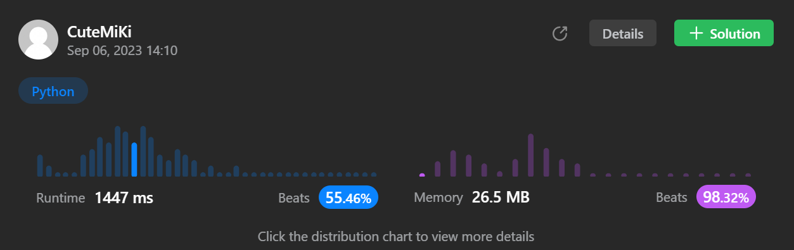

# 2817. Minimum Absolute Difference Between Elements With Constraint
### Tag: [Medium](https://github.com/TheOnlyMiki/LeetCode-For-Fun/tree/main#medium-level), [Array](https://github.com/TheOnlyMiki/LeetCode-For-Fun/tree/main#array), [Binary Search](https://github.com/TheOnlyMiki/LeetCode-For-Fun/tree/main#binary-search)
---
<div class="px-5 pt-4"><div class="flex"></div><div class="xFUwe" data-track-load="description_content"><p>You are given a <strong>0-indexed</strong> integer array <code>nums</code> and an integer <code>x</code>.</p>

<p>Find the <strong>minimum absolute difference</strong> between two elements in the array that are at least <code>x</code> indices apart.</p>

<p>In other words, find two indices <code>i</code> and <code>j</code> such that <code>abs(i - j) &gt;= x</code> and <code>abs(nums[i] - nums[j])</code> is minimized.</p>

<p>Return<em> an integer denoting the <strong>minimum</strong> absolute difference between two elements that are at least</em> <code>x</code> <em>indices apart</em>.</p>

<p>&nbsp;</p>
<p><strong class="example">Example 1:</strong></p>

<pre><strong>Input:</strong> nums = [4,3,2,4], x = 2
<strong>Output:</strong> 0
<strong>Explanation:</strong> We can select nums[0] = 4 and nums[3] = 4. 
They are at least 2 indices apart, and their absolute difference is the minimum, 0. 
It can be shown that 0 is the optimal answer.
</pre>

<p><strong class="example">Example 2:</strong></p>

<pre><strong>Input:</strong> nums = [5,3,2,10,15], x = 1
<strong>Output:</strong> 1
<strong>Explanation:</strong> We can select nums[1] = 3 and nums[2] = 2.
They are at least 1 index apart, and their absolute difference is the minimum, 1.
It can be shown that 1 is the optimal answer.
</pre>

<p><strong class="example">Example 3:</strong></p>

<pre><strong>Input:</strong> nums = [1,2,3,4], x = 3
<strong>Output:</strong> 3
<strong>Explanation:</strong> We can select nums[0] = 1 and nums[3] = 4.
They are at least 3 indices apart, and their absolute difference is the minimum, 3.
It can be shown that 3 is the optimal answer.
</pre>

<p>&nbsp;</p>
<p><strong>Constraints:</strong></p>

<ul>
	<li><code>1 &lt;= nums.length &lt;= 10<sup>5</sup></code></li>
	<li><code>1 &lt;= nums[i] &lt;= 10<sup>9</sup></code></li>
	<li><code>0 &lt;= x &lt; nums.length</code></li>
</ul>
</div></div>

---


### Solution

```python
class Solution(object):
    def minAbsoluteDifference(self, nums, x):
        """
        :type nums: List[int]
        :type x: int
        :rtype: int
        """
        def binarySearchIndex(num):
            right = len(self.sortedNums)
            if right == 0 or self.sortedNums[-1] <= num:
                return right

            left = 0
            mid = current = None
            while left <= right:
                mid = (left + right) // 2
                current = self.sortedNums[mid]
                if current < num:
                    left = mid+1
                elif current > num:
                    right = mid-1
                else:
                    return mid

            return left

        self.sortedNums = []
        self.length = 0
        output = 1e10

        num = index = None
        for i in range(x, len(nums)):
            num = nums[i-x]
            index = binarySearchIndex(num)
            if len(self.sortedNums) == index:
                self.sortedNums.append(num)
            else:
                self.sortedNums.insert(index, num)

            num = nums[i]
            index = binarySearchIndex(num)
            if index != 0:
                output = min(output, num - self.sortedNums[index-1])
            if index != len(self.sortedNums):
                output = min(output, self.sortedNums[index] - num)
            
        return output
```
