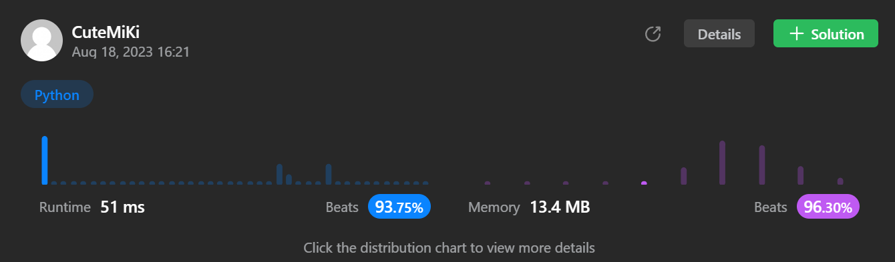

# 300. Longest Increasing Subsequence
### Tag: [Medium](https://github.com/TheOnlyMiki/LeetCode-For-Fun/tree/main#medium-level), [Array](https://github.com/TheOnlyMiki/LeetCode-For-Fun/tree/main#array), [Dynamic Programming](https://github.com/TheOnlyMiki/LeetCode-For-Fun/tree/main#dynamic-programming), [Binary Search](https://github.com/TheOnlyMiki/LeetCode-For-Fun/tree/main#binary-search)
---
<div class="px-5 pt-4"><div class="flex"></div><div class="xFUwe" data-track-load="description_content"><p>Given an integer array <code>nums</code>, return <em>the length of the longest <strong>strictly increasing </strong></em><span data-keyword="subsequence-array" datakeyword="subsequence-array" class=" cursor-pointer relative text-dark-blue-s text-sm"><div class="popover-wrapper inline-block" data-headlessui-state=""><div><div id="headlessui-popover-button-:r10:" aria-expanded="false" data-headlessui-state=""><div><em><strong>subsequence</strong></em></div></div><div style="position: fixed; z-index: 9999; inset: 0px auto auto 0px; transform: translate(189px, 242px);"></div></div></div></span>.</p>

<p>&nbsp;</p>
<p><strong class="example">Example 1:</strong></p>

<pre><strong>Input:</strong> nums = [10,9,2,5,3,7,101,18]
<strong>Output:</strong> 4
<strong>Explanation:</strong> The longest increasing subsequence is [2,3,7,101], therefore the length is 4.
</pre>

<p><strong class="example">Example 2:</strong></p>

<pre><strong>Input:</strong> nums = [0,1,0,3,2,3]
<strong>Output:</strong> 4
</pre>

<p><strong class="example">Example 3:</strong></p>

<pre><strong>Input:</strong> nums = [7,7,7,7,7,7,7]
<strong>Output:</strong> 1
</pre>

<p>&nbsp;</p>
<p><strong>Constraints:</strong></p>

<ul>
	<li><code>1 &lt;= nums.length &lt;= 2500</code></li>
	<li><code>-10<sup>4</sup> &lt;= nums[i] &lt;= 10<sup>4</sup></code></li>
</ul>

<p>&nbsp;</p>
<p><b>Follow up:</b>&nbsp;Can you come up with an algorithm that runs in&nbsp;<code>O(n log(n))</code> time complexity?</p>
</div></div>

---


### Solution

```python
class Solution(object):
    def lengthOfLIS(self, nums):
        """
        :type nums: List[int]
        :rtype: int
        """
        # Option 2
        def insertMostLeft(a, x):
            left, right, mid = 0, len(a), None
            while left < right:
                mid = (left + right) / 2
                if a[mid] < x: 
                    left = mid + 1
                else: 
                    right = mid
            return left

        record = []
        temp = None

        for num in nums:
            if not record or record[-1] < num:
                record.append(num)
            else:
                record[insertMostLeft(record, num)] = num
        
        return len(record)

        # Option 1
        """
        record = [1] * len(nums)
        temp = None

        for i, num in enumerate(nums):
            temp = -1
            for j in xrange(i):
                if nums[j] < num and temp < record[j]:
                    temp = record[j]

            record[i] = temp+1 if temp != -1 else 1
        
        return max(record)
        """
```
