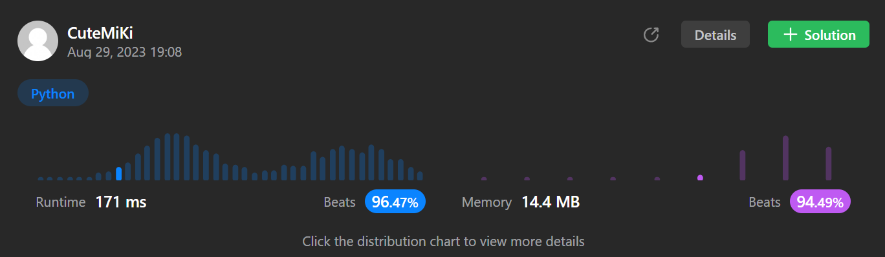

# 704. Binary Search
### Tag: [Easy](https://github.com/TheOnlyMiki/LeetCode-For-Fun/tree/main#easy-level), [Array](https://github.com/TheOnlyMiki/LeetCode-For-Fun/tree/main#array), [Binary Search](https://github.com/TheOnlyMiki/LeetCode-For-Fun/tree/main#binary-search)
---
<div class="px-5 pt-4"><div class="flex"></div><div class="xFUwe" data-track-load="description_content"><p>Given an array of integers <code>nums</code> which is sorted in ascending order, and an integer <code>target</code>, write a function to search <code>target</code> in <code>nums</code>. If <code>target</code> exists, then return its index. Otherwise, return <code>-1</code>.</p>

<p>You must write an algorithm with <code>O(log n)</code> runtime complexity.</p>

<p>&nbsp;</p>
<p><strong class="example">Example 1:</strong></p>

<pre><strong>Input:</strong> nums = [-1,0,3,5,9,12], target = 9
<strong>Output:</strong> 4
<strong>Explanation:</strong> 9 exists in nums and its index is 4
</pre>

<p><strong class="example">Example 2:</strong></p>

<pre><strong>Input:</strong> nums = [-1,0,3,5,9,12], target = 2
<strong>Output:</strong> -1
<strong>Explanation:</strong> 2 does not exist in nums so return -1
</pre>

<p>&nbsp;</p>
<p><strong>Constraints:</strong></p>

<ul>
	<li><code>1 &lt;= nums.length &lt;= 10<sup>4</sup></code></li>
	<li><code>-10<sup>4</sup> &lt; nums[i], target &lt; 10<sup>4</sup></code></li>
	<li>All the integers in <code>nums</code> are <strong>unique</strong>.</li>
	<li><code>nums</code> is sorted in ascending order.</li>
</ul>
</div></div>

---


### Solution

```python
class Solution(object):
    def search(self, nums, target):
        """
        :type nums: List[int]
        :type target: int
        :rtype: int
        """
        left, right = 0, len(nums)-1
        mid = current = None

        while left <= right:
            mid = (left + right) // 2
            current = nums[mid]
            if current > target:
                right = mid - 1
            elif current < target:
                left = mid + 1
            else:
                return mid

        return -1
```
