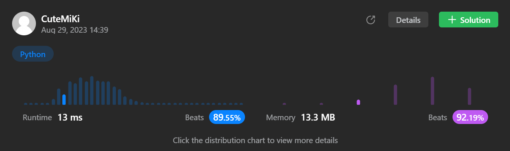

# 767. Reorganize String
### Tag: [Medium](https://github.com/TheOnlyMiki/LeetCode-For-Fun/tree/main#medium-level), [Hash Table](https://github.com/TheOnlyMiki/LeetCode-For-Fun/tree/main#hash-table), [String](https://github.com/TheOnlyMiki/LeetCode-For-Fun/tree/main#string), [Greedy](https://github.com/TheOnlyMiki/LeetCode-For-Fun/tree/main#greedy), [Sorting](https://github.com/TheOnlyMiki/LeetCode-For-Fun/tree/main#sorting), [Queue](https://github.com/TheOnlyMiki/LeetCode-For-Fun/tree/main#queue), [Counting](https://github.com/TheOnlyMiki/LeetCode-For-Fun/tree/main#counting)
---
<div class="px-5 pt-4"><div class="flex"></div><div class="xFUwe" data-track-load="description_content"><p>Given a string <code>s</code>, rearrange the characters of <code>s</code> so that any two adjacent characters are not the same.</p>

<p>Return <em>any possible rearrangement of</em> <code>s</code> <em>or return</em> <code>""</code> <em>if not possible</em>.</p>

<p>&nbsp;</p>
<p><strong class="example">Example 1:</strong></p>
<pre><strong>Input:</strong> s = "aab"
<strong>Output:</strong> "aba"
</pre><p><strong class="example">Example 2:</strong></p>
<pre><strong>Input:</strong> s = "aaab"
<strong>Output:</strong> ""
</pre>
<p>&nbsp;</p>
<p><strong>Constraints:</strong></p>

<ul>
	<li><code>1 &lt;= s.length &lt;= 500</code></li>
	<li><code>s</code> consists of lowercase English letters.</li>
</ul>
</div></div>

---


### Solution

```python
import heapq
class Solution(object):
    def reorganizeString(self, s):
        """
        :type s: str
        :rtype: str
        """
        s = list(s)
        length = len(s)
        record = []
        temp = c = nums = None
        for c in "abcdefghijklmnopqrstuvwxyz":
            temp = s.count(c)
            if temp > 0:
                heapq.heappush(record, [-temp, c])

        if length + record[0][0] < -(record[0][0]+1):
            return ""

        temp = 0
        while record[0][0] != 0:
            s[temp] = record[0][1]
            temp += 2
            record[0][0] += 1
        
        for i in range(1, len(record)):
            nums, c = record[i]
            while nums != 0:
                if temp >= length:
                    temp = 1

                s[temp] = c
                temp += 2
                nums += 1

        return ''.join(s)
```
